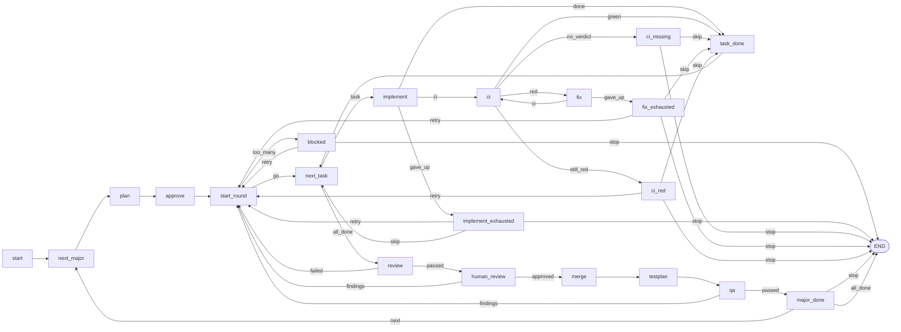

# Janus 4.1 Slice 5: The Angular Example as a Node Flow Implementation Plan

> **For agentic workers:** REQUIRED SUB-SKILL: Use superpowers:subagent-driven-development (recommended) or superpowers:executing-plans to implement this plan task-by-task. Steps use checkbox (`- [ ]`) syntax for tracking.

**Goal:** Rewrite `examples/angular-upgrade/flow.py` as the 21-node flow of design section 3.2 on the slice 4 engine, give `review.md` the `{{findings}}` paragraph of 3.3, rewrite the example's tests for the node keys and the recorded path, rewrite the README and spec sections 10 and 14 around the node table, close the four items parked from slice 4, and run trial 3 with real Codex: one round sent back by the human review, the journal's `path` reading as the map, `usage` on every Codex entry, and a round-2 review that no longer rejects the requested edit.

**Architecture:** The flow becomes a state machine whose states are small functions: each `@node(next=...)` says where it can go, returns a label, and keeps everything a later node needs on the state `s` (`s.round`, `s.findings`, `s.task_index`, `s.finished`, ...), which the engine rebuilds on every run by replaying the journaled steps. The three loops of slice 3 become edges backwards (`major_done -- next --> next_major`, four edges into `start_round`, `task_done --> next_task`, `fix -- ci --> ci`), `SendBack`, `stop_run`, `run_round`, `run_task`, `verify_in_ci` and `ask_after_exhausted` disappear, and no `key=` is passed anywhere because the engine prefixes every key with `<node>#<visit>/`. Two helpers stay plain functions: `send_back(s, findings)` (stores the findings and logs the round coming back) and `give_up(s, what, attempts)` (the blocker report shared by `implement_exhausted` and `fix_exhausted`). `stop` at any decision ends the flow through `END` with exit 0. The engine changes in one place only, `read_usage`, for a parked item; the starter folder's prompts and the skill get two parked wording fixes. The flow is built in two tasks (everything but CI, then the five CI nodes), each with its test scenarios, then the README with the mermaid block that a test compares with `python janus.py graph`, then the spec, then the manual trial.

**Tech Stack:** Python 3.9+ for the example code (`flow.py` and `teamcity.py` use `%` formatting, no f-strings, as the example always has; tests may use f-strings), PyYAML 6, pytest via `uv` (`/snap/bin/uv` 0.12.17), git 2.43.0, codex-cli 0.155.1 with `gpt-5.6-sol` at `xhigh` from `~/.codex/config.toml` (trial only), Node v24.5.0, pnpm 10.33.0 and Google Chrome at `/usr/bin/google-chrome` (trial only).

**Spec:** `/home/race-day/janus/docs/superpowers/specs/2026-09-24-janus-nodes-and-ui-design.md` (the design; section 3 defines this slice, section 2 the engine it builds on) and `/home/race-day/janus/janus-4.0-spec.md` v0.3 (the engine spec; sections 4 to 7 are binding facts, sections 9, 10 and 14 are edited here). Executors read both, plus `/home/race-day/janus/skills/janus-flow/SKILL.md`, the authoring rules the example must obey.

**Paths:** execution happens in a git worktree at `/home/race-day/janus/.worktrees/slice5-example` on branch `slice5-example`, created from the repository root with `git worktree add .worktrees/slice5-example -b slice5-example` (`.worktrees/` is in `.git/info/exclude`; a `slice6-ui` worktree already exists beside it and is not touched). Every path in this plan is relative to that worktree root, except the trial folders under `/home/race-day/janus-trial/`. `uv run pytest -q` from the worktree root runs the engine suite and the example suite (pyproject's `testpaths`).

## Global Constraints

Copied from the design and the spec where they bind this slice; every task's requirements include this section.

- Design §3, opening: "`examples/angular-upgrade/flow.py` is rewritten; the prompts keep their contracts except one change below; `teamcity.py` is unchanged."
- Design §3.1: "`s` carries: `majors` (copy of `MAJORS`), `major_index`, `target`, `plan`, `round`, `allowed`, `findings`, `task_index`, `task`, `finished`, `result`, `ci_count`, `build`, `last` (the report of a ralph that gave up), `summary` (the AI review's summary), `testplan`."
- Design §3.2: the node table, 21 nodes with the edges as listed there; "Rules kept from today: a skipped implement task is left out of the round's review; `retry` never resets `round`; `findings` is the empty string in round 1. `stop` now ends the flow with exit 0 through END (it was `SystemExit(1)`); the `## Progress` line says who stopped it. `SendBack`, `stop_run`, `run_round`, `run_task`, `verify_in_ci` and `ask_after_exhausted` are gone."
- Design §3.3: "`review.md` gets a `{{findings}}` paragraph: 'The previous round came back with these findings; work that answers them is requested, not a defect: {{findings}}'. ... `implement.md` already has `{{findings}}`."
- Design §3.4: "README: 'The steps it journals' becomes 'The nodes' with the table of 3.2 and the mermaid from `python janus.py graph`; 'Loops' is rewritten as 'how a round comes back' in terms of edges; 'Starting a goal folder' mentions `graph`. Trials 1 and 2 stay as history with a note that their keys are 4.0 keys." and "Spec sections 10 and 14 are rewritten around the node table; section 14's two rules about keys become one: a node flow needs no explicit keys."
- Design §3.5: "`examples/angular-upgrade/tests/test_flow.py` is rewritten for the node keys (`implement#1/implement#1/1`, `review#1/review#1`, gates `approve#1/gate#1`, `human_review#1/gate#1`); every scenario it covers today (happy path, review send-back, human send-back, exhausted at implement with each answer, CI red then fix, blocked past MAX_ROUNDS, direction) is kept, plus: the path's `next` labels of a send-back round, and `python janus.py graph` on the example matching the README diagram." and "Trial 3 with real Codex on the throwaway app, one round sent back by the human as in trial 2, evidence under `~/janus-trial/slice5-*`, report in the README. Acceptance: the journal's `path` reads as the sequence the mermaid shows, and the round-2 review no longer rejects the requested edit."
- Design §2.1: "`next` is one of: `"name"` one edge, unlabelled; the function must return None; `{"label": "name", ...}` one edge per label; the function returns a label; `END` the flow ends after this node; the function must return None"; "A label ... must match `[A-Za-z_]\w*`"; "A node name ... may not be one of the flowchart keywords `end`, `graph`, `flowchart`, `subgraph`, `style`, `class`, `classDef`, `click`, `linkStyle`, `direction`". Engine: `LABEL` and `MERMAID_KEYWORDS` in `janus.py`.
- Design §2.2: "While node `X` is in its `n`-th visit the engine sets `NODE = "X#n"` and empties `COUNTERS`. `make_key` returns `f"{NODE}/{key}"` where `key` is the explicit key or `<stem>#<count within this visit>`." So `ralph("prompts/implement.md", ...)` in visit 3 of `implement` is `implement#3/implement#1/<n>`, `step("wait", fn)` in visit 2 of `ci` is `ci#2/wait`, a `human_gate` is `<node>#<n>/gate#1`, a `decision` is `<node>#<n>/decision#1`.
- Design §2.1: "The state `s` is a `types.SimpleNamespace()` created fresh for each run. The engine never persists it; every run rebuilds it by replaying". Skill: "never read `journal.yaml`, the clock or a random source to choose an edge: the same journal must give the same path."
- Design §2.3 and §2.4: a finished visit that returns another label, or a visit whose node differs from the recorded one, raises `flow changed`; an undeclared label raises `node X returned 'y'; declared: a, b, c` after the node's steps ran.
- Design §2.10 as amended by this plan (Task 1): `read_usage` skips a rollout line that is not JSON and returns `None` only when no usage event was read.
- Skill (authoring rules the example must follow): "A single-edge node returns nothing. A multi-edge node returns one of its labels, and only a label"; "Anything with a side effect that must not repeat (a push, a test run, a poll) goes in `step(key, fn)`"; "`prompts/_preamble.md` ... keep it to `goal`, `attempt` and `context()` values"; "`show=` at a gate ... pass a summary and short lines, not whole results"; "`flow.py` catches `Exhausted` where a human should decide, and never catches `SystemExit`."
- Spec §4 Output schema: "All fields are required and no additional properties are allowed." Every field the flow reads is declared in the matching prompt; `review.md` declares `passed`, `reasons`, `summary`.
- Spec §12.6: "`janus.py` contains no reference to Git branches, pull requests, TeamCity, Bitbucket or Angular, apart from committing its own two files." Task 1's engine edit touches `read_usage` only; Task 2 touches the starter prompt texts only.
- Spec §12.8: `janus.py` stays one file with only the standard library and PyYAML. Unaffected.
- Example code (`flow.py`, `teamcity.py`) uses `%` formatting and no f-strings. Tests may use f-strings.
- No line over 120 characters in any file this plan creates or rewrites, except markdown table rows (the README's node table and the spec's tables cannot wrap; the spec already has such rows). `awk 'length > 120 && !/^\|/' <file>` prints nothing for every file touched.
- Tooling: `uv run pytest -q` from the worktree root is the verification command of every task. The suite is **180 passed** before this plan and **182 passed** after it (180 → 181 after Task 1 → 181 after Tasks 2 and 3 → 174 after Task 4, which replaces 21 flow tests by 14 → 181 after Task 5 → 182 after Task 6; Tasks 7 and 8 add none).
- Commits: `type(scope): subject` with scopes `engine` (janus.py and its tests), `example` (the example folder), `skill` (the skill), `spec` (the engine spec and the design document). Two trailers in a separate `-m`, so they sit after a blank line:

  ```bash
  git commit -m "type(scope): subject" -m "Co-Authored-By: Claude Fable 5.1 <noreply@anthropic.com>
  Claude-Session: https://claude.ai/code/session_01MghcFnosThAtjAmtNQrbEw"
  ```

- Out of scope, by ruling: the runner error log key, the stray CLI positional, `status` after END, `janus_ui.py` mentions in engine or skill (the README's one sentence in Task 6 is the exception the ruling names), spec sections 11 and 12.

## Verified facts about this machine

Checked on 2026-09-24 while writing this plan; the numbers are observed, not assumed.

- The repository `/home/race-day/janus` is on `main` at `7ead3a9` (`docs(plan): slice 6 plan, the live page janus_ui.py`), clean; the only commit after `01258a8` (`docs(spec): state the path-tail check, DRY log, consumed usage and the name rules`), the commit this plan was rehearsed against, adds that plan document, so `janus.py`, the example, the spec, the skill and the tests are the same at both. `uv run pytest -q` gives **180 passed in 12.48s**. `git worktree list` shows the main checkout and `.worktrees/slice6-ui` at the same commit; `.worktrees/slice5-example` does not exist yet.
- `python3` is 3.12.3 with PyYAML 6.0.1 system-wide, so `python3 janus.py run` works in a goal folder without a venv. `uv` is 0.12.17; `codex --version` prints **codex-cli 0.155.1**. `~/.codex/config.toml` sets `model = "gpt-5.6-sol"`, `model_reasoning_effort = "xhigh"`, `personality = "pragmatic"`; Janus passes no model flags. `~/.codex/sessions/2026/` exists, so `CODEX_HOME` is the default and rollout files land where `read_usage` globs.
- `janus.py` is 829 lines. The facts this slice relies on: `node()` normalises `next` into `edges` and validates labels against `LABEL = re.compile(r"[A-Za-z_]\w*")` and names against `MERMAID_KEYWORDS` (lines 504-530); `make_key` prefixes `NODE` (lines 270-277); `run_nodes` walks from `graph()["start"]`, appends a path entry per visit, checks a finished entry's `next` and raises `flow changed` on a mismatch or a stale tail (lines 577-605); `check_label` (lines 545-553) turns `None` into `""` for a single edge; `cmd_graph` loads the flow with `DRY = True` and prints `to_mermaid(graph())` (lines 671-683); `cmd_status` prints `at: <node>#<visit> (visit n of <node>)` first when the journal has a path and the `tokens:` line when any entry has `usage` (lines 686-699); `read_usage` returns `None` on any exception, including one bad line (lines 325-339); `STARTER_PREAMBLE` says "commit your own work and report the commit" and `STARTER_DRAFT` says "Do the work the goal describes, in the current folder." (lines 751-775); `cmd_run` maps `SystemExit(2)` from a gate to exit 2 and ends a node flow that reached `END` with `flow ended` and exit 0 (lines 641-668).
- The example today: `flow.py` is 187 lines of script flow with explicit keys (`v16/r1/implement/app/1`); `tests/test_flow.py` has 21 tests over the fixtures of `tests/conftest.py`: `fake_codex` (the engine's, loaded by path), `without_teamcity` (autouse: deletes `JANUS_TEAMCITY_URL`/`JANUS_TEAMCITY_TOKEN` and calls `teamcity.reload_env()`, so `teamcity.configured()` is false in every test that does not ask for `teamcity_server`), `teamcity_server` (an `http.server` stub on 127.0.0.1 whose `serve(bodies)` queues JSON answers, sets both variables and reloads them, so `configured()` is true) and `goal_folder` (a copy of `flow.py`, `teamcity.py`, `JANUS.md` and `prompts/` into `tmp_path/angular-16-upgrade` with an empty `app/` sub-folder). `conftest.py` and `test_teamcity.py` need no change. `README.md` is 515 lines with no mermaid block; `awk 'length > 120'` prints nothing for it today.
- `skills/janus-flow/SKILL.md` is 199 lines; `tests/test_skill.py` asserts `len(text.splitlines()) < 200`, so a bullet can only be added if a line goes. Its line 72 (`- \`next\` is a node name, a dict of label to node name (a value may be \`END\`), or \`END\`.`) repeats what the primitives block (lines 57-62) already says.
- Trial evidence from slice 3 lives at `/home/race-day/janus-trial/slice3-angular-16/` (goal folder: `app/` the product clone, `flow.py`, `janus.py`, `JANUS.md`, `journal.yaml`, `prompts/`, `teamcity.py`, `.gitignore`; remote `origin` = `/home/race-day/janus-trial/origin/slice3-angular-16.git`, last commit `8210e37 janus: run ended`), `/home/race-day/janus-trial/slice3-journal-after-run2.yaml`, `/home/race-day/janus-trial/slice3-journal-final.yaml` and `slice3-run1.log` to `slice3-run7.log` beside them. The README's "Trial 2" section is the report of that folder.
- `/home/race-day/janus-trial/origin/` holds four bares: `angular-16-upgrade.git` (slice 2 goal folder), `ng15-app.git` (`master` at `f8dc4e4 initial commit` **and** `ai/angular-15-to-16` at `4c0703e`, pushed by Codex in trial 1), `ng15-app-slice3.git` (`master` at `f8dc4e4` **and** `ai/angular-15-to-16` at `b0a1ed4`, pushed in trial 2) and `slice3-angular-16.git`. Both app bares already carry the upgrade branch, so trial 3 needs a fresh single-branch bare made from `master` alone, as trial 2 did: `git clone --bare --single-branch --branch master origin/ng15-app.git origin/ng15-app-slice5.git`. `master`'s `README.md` line 3 is `This project was generated with [Angular CLI](https://github.com/angular/angular-cli) version 15.2.11.`, its `package.json` has `@angular/*` `^15.2.0`, `@angular/cli` `~15.2.11`, `typescript` `~4.9.4`, `zone.js` `~0.12.0`.
- All code in this plan was assembled in a clone of the repository under `/tmp/claude-1000/-home-race-day-janus/4a798f63-0c32-4e2c-931a-e28afb628aeb/scratchpad/plan5-check` and run with `uv run pytest -q` at every red and green step; a second clone at `01258a8` (`plan5-old`) supplied the red runs against the old engine and the old flow. See *Self-review notes*. The real repository was not modified and the real Codex was not run.

## Design decisions fixed here (where the design leaves room)

- **`start_round` checks the allowance before it counts.** The table says "`round += 1` ...; `too_many` when `round > allowed`" and "`retry: start_round`"; taken literally, visit 4 of `start_round` sets `round = 4`, goes to `blocked`, and `retry` re-enters `start_round` which sets `round = 5`, so round 4 is never numbered and the log says "reached in 5 round(s)" after four. The flow therefore returns `too_many` when `s.round >= s.allowed` *before* incrementing (round 3 done, allowance 3), and `retry` re-enters `start_round`, which then counts round 4. The kept scenario "blocked past MAX_ROUNDS, retry continues to round 4" is what the test asserts (`implement#4/...` and "Review the pull requests of round 4"). The `blocked` question and the stop line use `s.round` (3), the rounds that ran.
- **Two helpers, not one.** `give_up(s, what, attempts)` is the shared blocker report the user's mock named. `send_back(s, findings)` is added: five edges into `start_round` (`review -- failed`, `human_review -- findings`, `qa -- findings`, `retry` at `implement_exhausted`/`fix_exhausted`, `retry` at `ci_red`) all set `s.findings` and log `round N of Angular T came back: ...`, the line slice 3's major loop wrote once; a helper keeps those five places identical.
- **`what` in the blocker strings is the stage name**, `implement` or `fix`, not a key: "Task app gave up at implement:\n<blockers>" (it was "gave up at v16/r1/implement/app"). Keys are now the engine's and carry a visit number that means nothing to Codex.
- **Every `stop` logs who stopped it** before returning `stop`: `blocked` "Angular N stopped by the human after M rounds" (the ruling's wording), `give_up` "task X stopped the run at <what>, as the human decided", `ci_missing` "task X stopped the run: no CI verdict, as the human decided", `ci_red` "task X stopped the run: still red after 3 CI verdicts, as the human decided", `major_done` "stopped after Angular N, as the human decided" (unchanged). The run then ends with `flow ended` and exit 0.
- **`review` keeps `s.summary`** before deciding, so `human_review`'s `show` has it; the reviewer's `reasons` are not kept on `s` beyond the findings string.
- **`ci` reads `s.result["commit"]`** at the time of the visit, so after `fix` updates `s.result` the next `ci` visit waits for the fix commit. The `step("wait", ...)` key is explicit and constant because each `ci` visit is its own prefix (`ci#1/wait`, `ci#2/wait`, ...). `s.ci_count` is reset in `implement`, so a second task in the same round starts its own count of verdicts while the `ci` visit numbers keep growing (`ci#4/wait` is the first verdict of round 2 in the retry-at-red test).
- **Visit numbers are per node, not per round.** The first human review of a round 2 that follows an AI-review send-back is `human_review#1/gate#1`; `merge` in round 2 after a human send-back is `merge#1/gate#1`. The tests assert exactly that and the README says it, because it is the first thing a reader of `journal.yaml` will trip over.
- **The graph test reads the README from the example folder** (`Path(__file__).resolve().parent.parent / "README.md"`), extracts the one fenced ```` ```mermaid ```` block and compares it with `janus.main(["graph"])`'s captured stdout in the `goal_folder`. `graph` runs `begin()` and loads `flow.py` with `DRY = True`; it writes no journal (asserted).
- **Task 4 builds the flow without the CI nodes** (`implement` has `done` and `gave_up` only, no `import teamcity`), so its 14 tests run with the autouse `without_teamcity` fixture alone; Task 5 adds the five CI nodes, the `ci` edge and the seven `teamcity_server` tests. The build-type-`none` test is among the seven because it needs `teamcity_server` to prove the skip.
- **The README's TeamCity section keeps its shape** and only its keys change (`ci#1/wait`, `fix#1/fix#1/<i>`, `ci_red`, `ci_missing`); the ruling names three sections to rewrite, but leaving 4.0 keys in a fourth would contradict the node table above it.
- **Trial 3 reuses trial 2's finding verbatim** at `human_review#1/gate#1`, so that the round-2 review's behaviour is comparable: trial 2's reviewer rejected the "Angular CLI 16" line; with `{{findings}}` in `review.md` it should now pass it. If it rejects it again, that is the trial's result and the README says so; the acceptance of design §3.5 is then not met on that point and the report says which.
- **Trial 3 folders:** goal folder `/home/race-day/janus-trial/slice5-angular-16` with bare `origin/slice5-angular-16.git`; app clone from the new single-branch bare `origin/ng15-app-slice5.git`; evidence files `slice5-run<N>.log`, `slice5-journal-after-run2.yaml`, `slice5-journal-final.yaml` under `/home/race-day/janus-trial/`, next to slice 3's.
- **The spec's "4.1"** in section 9 ("About thirty tests in 4.0; 4.1 adds items 13 to 21") becomes "About thirty tests in v0.2; v0.3 adds items 13 to 21", because the document is Janus 4.0 v0.3 and its header describes versions, not products.

## File structure

| Path | Responsibility | Task |
|---|---|---|
| `janus.py` | `read_usage`: skip an unparsable rollout line. `STARTER_PREAMBLE`, `STARTER_DRAFT`: one commit model. | 1, 2 |
| `tests/test_usage.py` | One new test: a truncated last line and a non-JSON line are skipped. | 1 |
| `tests/test_init.py` | Two assertions on the starter texts; one existing assertion updated. | 2 |
| `docs/superpowers/specs/2026-09-24-janus-nodes-and-ui-design.md` | §2.10 usage wording; §2.7 preamble row. | 1, 2 |
| `janus-4.0-spec.md` | §7 usage wording (Task 1); §9 "v0.3" wording, §10 and §14 rewritten around the node table (Task 7). | 1, 7 |
| `skills/janus-flow/SKILL.md` | One bullet on `flow changed` and the ways back; stays under 200 lines. | 3 |
| `examples/angular-upgrade/flow.py` | The node flow. Task 4: 16 nodes, everything but CI. Task 5: the five CI nodes and the `ci` edge. | 4, 5 |
| `examples/angular-upgrade/prompts/review.md` | The `{{findings}}` paragraph (design §3.3). | 4 |
| `examples/angular-upgrade/tests/test_flow.py` | Rewritten for node keys and the path. Task 4: 14 scenarios. Task 5: 7 CI scenarios. Task 6: the graph-vs-README test. | 4, 5, 6 |
| `examples/angular-upgrade/README.md` | Intro, files table, "Starting a goal folder", "The nodes" (table + mermaid), "How a round comes back", TeamCity keys, tests paragraph, history notes on trials 1 and 2 (Task 6); the trial 3 report (Task 8). | 6, 8 |
| `/home/race-day/janus-trial/slice5-angular-16/` and friends | Trial 3 evidence, outside the repository. | 8 |

Unchanged: `teamcity.py`, `JANUS.md`, `.gitignore`, `prompts/_preamble.md`, `prompts/plan.md`, `prompts/implement.md`, `prompts/fix.md`, `prompts/testplan.md`, `tests/conftest.py`, `tests/test_teamcity.py`, every engine test but the two named.

---

### Task 1: `read_usage` skips an unparsable rollout line (parked item a)

Design §2.10 says "bad JSON → None" for the whole file. A Codex killed mid-write leaves a truncated last line in its rollout, and every `token_count` event before it would be lost; the trial is likely to hit that. The ruling: skip the line, return `None` only when no usage event was read.

**Files:**
- Modify: `janus.py` (`read_usage`, lines 325-339)
- Modify: `tests/test_usage.py` (one test added before `test_codex_step_records_session_and_usage_next_to_the_result`)
- Modify: `docs/superpowers/specs/2026-09-24-janus-nodes-and-ui-design.md` (§2.10, one sentence)
- Modify: `janus-4.0-spec.md` (§7, one sentence)

**Interfaces:**
- Consumes: `read_usage(session_id) -> Optional[Dict[str, int]]`, the `codex_home` fixture and `usage_event(...)` helper of `tests/test_usage.py`, `OTHER` (a session id with no rollout until the test writes one).
- Produces: the same signature; a rollout with a bad line among good events returns the last good event's totals. The trial (Task 8) relies on it.

- [ ] **Step 1: Create the worktree and confirm the baseline**

```bash
cd /home/race-day/janus
git worktree add .worktrees/slice5-example -b slice5-example
cd .worktrees/slice5-example
uv run pytest -q 2>&1 | tail -1
```

Expected: `180 passed`.

- [ ] **Step 2: Write the failing test**

In `tests/test_usage.py`, insert before `def test_codex_step_records_session_and_usage_next_to_the_result(`:

```python
def test_read_usage_skips_an_unparsable_line_and_keeps_the_events_around_it(codex_home):
    truncated = '{"timestamp": "2026-09-24T10:00:00.000Z", "type": "event_msg", "payload": {"type": "token_co'
    codex_home(OTHER, usage_event(10, 0, 5, 15) + "\n" + usage_event(20, 1, 6, 27) + "\n" + truncated)
    assert janus.read_usage(OTHER) == {"input": 20, "cached": 1, "output": 6, "total": 27}
    codex_home(OTHER, "not json\n42\n" + usage_event(3, 0, 1, 4) + "\n")
    assert janus.read_usage(OTHER) == {"input": 3, "cached": 0, "output": 1, "total": 4}


```

The existing `test_read_usage_returns_none_for_a_missing_file_bad_json_or_missing_keys` stays as it is: a file that is *only* `not json` still gives `None`, because no usage event was read.

- [ ] **Step 3: Run the test to verify it fails**

Run: `uv run pytest -q tests/test_usage.py`

Expected (observed in rehearsal against the unchanged engine):

```
E       AssertionError: assert None == {'cached': 1, 'input': 20, 'output': 6, 'total': 27}
1 failed, 10 passed
```

- [ ] **Step 4: Change `read_usage`**

In `janus.py`, replace:

```python
def read_usage(session_id: str) -> Optional[Dict[str, int]]:
    """Token usage of a Codex session from its rollout file under CODEX_HOME (design 2.10): the last
    ``token_count`` event's totals, or None when anything about the file is missing or malformed."""
    home = Path(os.environ.get("CODEX_HOME") or Path.home() / ".codex")
    totals = None
    try:
        rollout = next(iter(home.glob(f"sessions/*/*/*/rollout-*-{session_id}.jsonl")))
        for line in rollout.read_text(encoding="utf-8").splitlines():
            event = json.loads(line)
            if event.get("type") == "event_msg" and event["payload"].get("type") == "token_count":
                totals = (event["payload"].get("info") or {}).get("total_token_usage", totals)
```

with:

```python
def read_usage(session_id: str) -> Optional[Dict[str, int]]:
    """Token usage of a Codex session from its rollout file under CODEX_HOME (design 2.10): the last
    ``token_count`` event's totals. A line that is not JSON is skipped (a killed Codex leaves a truncated
    last line); None when the file is missing or no usage event could be read from it."""
    home = Path(os.environ.get("CODEX_HOME") or Path.home() / ".codex")
    totals = None
    try:
        rollout = next(iter(home.glob(f"sessions/*/*/*/rollout-*-{session_id}.jsonl")))
        for line in rollout.read_text(encoding="utf-8").splitlines():
            try:
                event = json.loads(line)
            except ValueError:
                continue
            if isinstance(event, dict) and event.get("type") == "event_msg" \
                    and (event.get("payload") or {}).get("type") == "token_count":
                totals = (event["payload"].get("info") or {}).get("total_token_usage", totals)
```

The `return {...}` and `except Exception: return None` lines that follow stay unchanged: with `totals` still `None` the subscription raises and the function returns `None`, which is the "no usage event was read" case.

- [ ] **Step 5: Run the tests to verify they pass**

Run: `uv run pytest -q tests/test_usage.py`

Expected: `11 passed`.

- [ ] **Step 6: Say it in both documents**

In `docs/superpowers/specs/2026-09-24-janus-nodes-and-ui-design.md` §2.10, replace the sentence

`Any failure (no id in the transcript, no file, bad JSON, missing keys) returns `None`; nothing is printed, nothing stops.`

with

`An unparsable line is skipped (a killed Codex leaves a truncated last line); `None` only when no usage event was read (no id in the transcript, no file, no `token_count` event, missing keys). Nothing is printed, nothing stops.`

In `janus-4.0-spec.md` §7, replace the sentence

`No id, no file, bad JSON or missing keys leave the fields out without a message.`

with

`A rollout line that is not JSON is skipped (a killed Codex leaves a truncated last line); no id, no file, no usage event or missing keys leave the fields out without a message.`

- [ ] **Step 7: Run the whole suite and commit**

```bash
uv run pytest -q 2>&1 | tail -1
git add janus.py tests/test_usage.py docs/superpowers/specs/2026-09-24-janus-nodes-and-ui-design.md janus-4.0-spec.md
git commit -m "fix(engine): read_usage skips an unparsable rollout line" -m "Co-Authored-By: Claude Fable 5.1 <noreply@anthropic.com>
Claude-Session: https://claude.ai/code/session_01MghcFnosThAtjAmtNQrbEw"
```

Expected: `181 passed`.

### Task 2: The starter folder states one commit model (parked item b)

`init` writes a `.gitignore` of `*/`, does not run `git init`, and its preamble says "commit your own work and report the commit" without saying where. The ruling: state one model in `STARTER_DRAFT` and `STARTER_PREAMBLE`: "the work happens in a repository checkout inside this folder; commit there and report the commit".

**Files:**
- Modify: `janus.py` (`STARTER_PREAMBLE` lines 751-756, `STARTER_DRAFT` lines 758-775)
- Modify: `tests/test_init.py` (`test_init_creates_the_starter_folder_and_refuses_a_second_time`, `test_the_starter_flow_has_a_graph_and_runs_to_its_gate_and_to_the_end`)
- Modify: `docs/superpowers/specs/2026-09-24-janus-nodes-and-ui-design.md` (§2.7 table, the `prompts/_preamble.md` row)

**Interfaces:**
- Consumes: `STARTER_FILES` (unchanged), the `answer(root, text)` helper of `tests/test_init.py`.
- Produces: the two starter texts below; the skill and the design describe them, nothing else reads them.

- [ ] **Step 1: Write the failing assertions**

In `tests/test_init.py`, inside `test_init_creates_the_starter_folder_and_refuses_a_second_time`, replace:

```python
    assert (goal / "prompts" / "_preamble.md").read_text(encoding="utf-8").startswith("{{goal}}\n")
```

with:

```python
    preamble = (goal / "prompts" / "_preamble.md").read_text(encoding="utf-8")
    assert preamble.startswith("{{goal}}\n")
    assert "the work happens\nin a repository checkout inside this folder; commit there and report the commit." in preamble
    assert "in the repository checkout inside the current folder; commit there" in \
        (goal / "prompts" / "draft.md").read_text(encoding="utf-8")
```

- [ ] **Step 2: Run the tests to verify they fail**

Run: `uv run pytest -q tests/test_init.py`

Expected (observed against the unchanged engine): `1 failed, 3 passed` with

```
E       AssertionError: assert 'the work happens\nin a repository checkout inside this folder; commit there and report the commit.' in '{{goal}}\n\nRules: report blockers instead of guessing; never echo secrets (tokens, passwords, keys); commit your own\nwork and report the commit.\n'
```

- [ ] **Step 3: Change the two starter texts**

In `janus.py`, replace:

```python
Rules: report blockers instead of guessing; never echo secrets (tokens, passwords, keys); commit your own
work and report the commit.
```

with:

```python
Rules: report blockers instead of guessing; never echo secrets (tokens, passwords, keys); the work happens
in a repository checkout inside this folder; commit there and report the commit.
```

and replace:

```python
Do the work the goal describes, in the current folder.
```

with:

```python
Do the work the goal describes, in the repository checkout inside the current folder; commit there and
name the commit in your summary.
```

- [ ] **Step 4: Update the one existing assertion on the old sentence**

In `tests/test_init.py`, inside `test_the_starter_flow_has_a_graph_and_runs_to_its_gate_and_to_the_end`, replace:

```python
    assert "Do the work the goal describes, in the current folder." in prompt
```

with:

```python
    assert "Do the work the goal describes, in the repository checkout inside the current folder" in prompt
```

- [ ] **Step 5: Run the tests to verify they pass**

Run: `uv run pytest -q tests/test_init.py`

Expected: `4 passed`. (Rehearsal ran Tasks 1 and 2 together: `uv run pytest -q tests/test_usage.py tests/test_init.py` gave `15 passed`.)

- [ ] **Step 6: Say it in the design**

In `docs/superpowers/specs/2026-09-24-janus-nodes-and-ui-design.md` §2.7, in the `prompts/_preamble.md` row, replace

`report blockers instead of guessing, never echo secrets, commit your own work and report the commit |`

with

`report blockers instead of guessing, never echo secrets, the work happens in a repository checkout inside this folder (commit there and report the commit) |`

- [ ] **Step 7: Run the whole suite and commit**

```bash
uv run pytest -q 2>&1 | tail -1
git add janus.py tests/test_init.py docs/superpowers/specs/2026-09-24-janus-nodes-and-ui-design.md
git commit -m "fix(engine): the starter folder states one commit model" -m "Co-Authored-By: Claude Fable 5.1 <noreply@anthropic.com>
Claude-Session: https://claude.ai/code/session_01MghcFnosThAtjAmtNQrbEw"
```

Expected: `181 passed`.

### Task 3: The skill says what to do after `flow changed` (parked item c)

**Files:**
- Modify: `skills/janus-flow/SKILL.md` (three edits; the file must stay under 200 lines, `tests/test_skill.py` asserts it)

**Interfaces:**
- Consumes: the engine's `flow changed: ...` errors (design §2.3), `python janus.py reset`, the `path` list of `journal.yaml`.
- Produces: nothing code reads; Codex reads the skill.

- [ ] **Step 1: Confirm the line budget**

Run: `wc -l skills/janus-flow/SKILL.md`

Expected: `199`. The test allows at most 199 lines, so the two-line bullet below needs two lines freed.

- [ ] **Step 2: Remove the bullet that repeats the primitives block**

In the "Node rules" list, delete the line:

```markdown
- `next` is a node name, a dict of label to node name (a value may be `END`), or `END`.
```

(The `node(next)` entry of the primitives block already says it, in full.)

- [ ] **Step 3: Add the bullet**

Directly after the keys bullet, whose last line is:

```markdown
  `plan#2` already; two `step("wait", ...)` are not).
```

insert:

```markdown
- After editing `flow.py` mid-run, `run` may fail with `flow changed`. The ways back: `python janus.py reset`,
  or delete the changed `path` entries from `journal.yaml`; steps replay by key, so nothing runs twice.
```

- [ ] **Step 4: Free the second line under Example 2**

Replace the two lines after Example 2's code block:

```markdown
`retry` at `blocked` goes back to `draft`, which is visit 4 of `draft` with fresh keys; the round counter
is only ever advanced by the flow itself.
```

with one line:

```markdown
`retry` at `blocked` goes back to `draft`: visit 4 of `draft`, with fresh keys; only the flow advances the round.
```

- [ ] **Step 5: Check the budget and the tests**

```bash
wc -l skills/janus-flow/SKILL.md
awk 'length > 120 && FNR != 3' skills/janus-flow/SKILL.md
uv run pytest -q tests/test_skill.py
```

Expected: `199`; nothing from `awk` (line 3, the front matter description, is 229 characters today and is left alone); `3 passed`. This task has no red step: the skill's test is a line-count and vocabulary check, and both hold before and after.

- [ ] **Step 6: Commit**

```bash
git add skills/janus-flow/SKILL.md
git commit -m "docs(skill): the way back after flow changed" -m "Co-Authored-By: Claude Fable 5.1 <noreply@anthropic.com>
Claude-Session: https://claude.ai/code/session_01MghcFnosThAtjAmtNQrbEw"
```

### Task 4: The node flow without CI, the review prompt's findings, and the tests of every non-CI scenario

Design §3.1, §3.2 (all nodes except `ci`, `ci_missing`, `fix`, `fix_exhausted`, `ci_red`), §3.3, §3.5 (every scenario that does not need TeamCity, plus the path's `next` labels).

**Files:**
- Rewrite: `examples/angular-upgrade/flow.py` (187 lines of script flow become 191 lines of 16 nodes)
- Modify: `examples/angular-upgrade/prompts/review.md` (one paragraph inserted)
- Rewrite: `examples/angular-upgrade/tests/test_flow.py` (21 tests become 14; Task 5 brings the CI ones back)

**Interfaces:**
- Consumes: `janus.node`, `janus.END`, `codex`, `ralph`, `human_gate`, `decision`, `log`, `context`, `Exhausted` as in `janus.py`; the prompts' `output` fields (`plan`: `summary`, `tasks[id, repo, title, objective, build_type]`; `implement`: `done`, `commit`, `summary`, `blockers`; `review`: `passed`, `reasons`, `summary`; `testplan`: `steps`, `summary`); the fixtures `goal_folder`, `fake_codex`, `monkeypatch` of `tests/conftest.py`.
- Produces: module constants `MAJORS`, `MAX_ROUNDS`, `MAX_IMPLEMENT`, `MAX_CI`, `MAX_FIX`, `CI_TIMEOUT`; helpers `task_line(record) -> str`, `send_back(s, findings) -> None`, `give_up(s, what, attempts) -> str`; nodes `start`, `next_major`, `plan`, `approve`, `start_round`, `blocked`, `next_task`, `implement` (edges `done`, `gave_up`; Task 5 adds `ci`), `implement_exhausted`, `task_done`, `review`, `human_review`, `merge`, `testplan`, `qa`, `major_done`; state fields of design §3.1 on `s`. Test helpers `run(folder, monkeypatch)`, `answer(folder, text)`, `journal_of(folder)`, `path_of(folder)`, `run_to_the_second_gate(folder, fake_codex, monkeypatch, script)` and the constants `PLAN`, `NOT_DONE`, `DONE`, `DONE_2`, `FIXED`, `REVIEW_OK`, `REVIEW_BAD`, `TESTPLAN`, `ONE_ROUND`, `PLAN_KEYS`, `ROUND_1`, `TO_FIRST_TASK`, which Task 5's tests use unchanged.

- [ ] **Step 1: Write the new test file**

Replace the whole of `examples/angular-upgrade/tests/test_flow.py` with:

```python
"""The example flow, end to end, with the engine's fake `codex` and a stubbed TeamCity.

Every test drives `janus.main(["run"])` in a copied goal folder the way a human would: run, answer
the one open gate in JANUS.md, run again. The keys are the engine's node keys: `<node>#<visit>/`
in front of each step's own key (`implement#1/implement#1/1`, `review#1/review#1`,
`approve#1/gate#1`), so a second round's implement is `implement#2/...` and the first human
review, even in round 2, is `human_review#1/gate#1`.
"""
from pathlib import Path

import yaml

import janus

EXAMPLE = Path(__file__).resolve().parent.parent

PLAN = {"summary": "One repository, app, goes from Angular 15 to Angular 16.",
        "tasks": [{"id": "app", "repo": "app", "title": "Upgrade app to Angular 16",
                   "objective": "app is on Angular 15.2. Run ng update to 16 and keep the tests green.",
                   "build_type": "app_Build"}]}
NOT_DONE = {"done": False, "commit": "", "summary": "ng update ran; the build still fails.",
            "blockers": ["app.component.ts does not compile"]}
DONE = {"done": True, "commit": "a" * 40, "summary": "Angular 16, build and tests green.", "blockers": []}
DONE_2 = {"done": True, "commit": "c" * 40, "summary": "Round 2: the findings are addressed.", "blockers": []}
FIXED = {"done": True, "commit": "b" * 40, "summary": "Fixed the failing title spec.", "blockers": []}
REVIEW_OK = {"passed": True, "reasons": [], "summary": "The upgrade is complete and no test was weakened."}
REVIEW_BAD = {"passed": False, "reasons": ["app: app.component.spec.ts is marked xdescribe"],
              "summary": "The upgrade skips a spec."}
TESTPLAN = {"steps": ["Open / and see the title", "Navigate to /about and back"],
            "summary": "Bootstrapping and routing are the risk of this round."}
ONE_ROUND = [{"output": DONE}, {"output": REVIEW_OK}, {"output": TESTPLAN}]
PLAN_KEYS = ["plan#1/plan#1", "approve#1/gate#1"]
ROUND_1 = ["implement#1/implement#1/1", "review#1/review#1", "human_review#1/gate#1", "merge#1/gate#1",
           "testplan#1/testplan#1", "qa#1/gate#1"]
TO_FIRST_TASK = [("start", ""), ("next_major", ""), ("plan", ""), ("approve", ""), ("start_round", "go"),
                 ("next_task", "task")]


def run(folder, monkeypatch):
    monkeypatch.chdir(folder)
    return janus.main(["run"])


def answer(folder, text):
    """Answer the one open gate: only one is ever open at a time."""
    path = folder / "JANUS.md"
    path.write_text(path.read_text(encoding="utf-8").replace("\nanswer:\n", "\nanswer: %s\n" % text),
                    encoding="utf-8")


def journal_of(folder):
    return yaml.safe_load((folder / "journal.yaml").read_text(encoding="utf-8"))


def path_of(folder):
    """The journal's path as (node, next) pairs; an unfinished visit has next None."""
    return [(e["node"], e.get("next")) for e in journal_of(folder)["path"]]


def run_to_the_second_gate(folder, fake_codex, monkeypatch, script):
    """Plan, run to the approval gate, answer 'yes', then run again and assert exit 2 wherever
    that second run stops: the human review, or one of the CI decisions, along the way."""
    fake_codex.script([{"output": PLAN}] + script)
    assert run(folder, monkeypatch) == 2
    answer(folder, "yes")
    assert run(folder, monkeypatch) == 2


def test_one_round_that_passes_every_check_ends_at_qa_passed(goal_folder, fake_codex, monkeypatch):
    run_to_the_second_gate(goal_folder, fake_codex, monkeypatch, ONE_ROUND)
    answer(goal_folder, "approved")
    assert run(goal_folder, monkeypatch) == 2
    answer(goal_folder, "merged")
    assert run(goal_folder, monkeypatch) == 2
    answer(goal_folder, "passed")
    assert run(goal_folder, monkeypatch) == 0
    journal = journal_of(goal_folder)
    steps = journal["steps"]
    assert list(steps) == PLAN_KEYS + ROUND_1
    assert [e["status"] for e in steps.values()] == \
        ["done", "answered", "done", "done", "answered", "answered", "done", "answered"]
    assert steps["review#1/review#1"]["kind"] == "codex" and steps["review#1/review#1"]["result"]["passed"] is True
    assert "ci#1/wait" not in steps and "major_done#1/decision#1" not in steps
    assert len(fake_codex.calls()) == 4
    assert path_of(goal_folder) == TO_FIRST_TASK + [
        ("implement", "done"), ("task_done", ""), ("next_task", "all_done"), ("review", "passed"),
        ("human_review", "approved"), ("merge", ""), ("testplan", ""), ("qa", "passed"), ("major_done", "all_done")]
    assert journal["graph"]["start"] == "start"
    assert "Angular 16 reached in 1 round(s)" in (goal_folder / "JANUS.md").read_text(encoding="utf-8")


def test_every_prompt_renders_with_the_branch_the_target_the_task_and_empty_findings(
        goal_folder, fake_codex, monkeypatch):
    run_to_the_second_gate(goal_folder, fake_codex, monkeypatch, [{"output": NOT_DONE}] + ONE_ROUND)
    plan, first, second, review = fake_codex.calls()[:4]
    assert plan["cwd"].endswith("angular-16-upgrade") and first["cwd"].endswith("angular-16-upgrade/app")
    assert "ai/angular-15-to-16" in plan["prompt"] and "Plan the upgrade to Angular 16." in plan["prompt"]
    assert "Upgrade every Angular application" in plan["prompt"]
    assert plan["schema"]["properties"]["tasks"]["items"]["required"] == \
        ["id", "repo", "title", "objective", "build_type"]
    assert "Upgrade app to Angular 16" in first["prompt"] and "This is attempt 1" in first["prompt"]
    assert "do not start over, and make sure this round resolves every finding.\n\n\n\nWhat the previous" \
        in first["prompt"]  # {{findings}} is the empty string in round 1, like {{previous}} in iteration 1
    assert "ng update ran; the build still fails." in second["prompt"]
    assert "Upgrade app to Angular 16" in review["prompt"] and "a" * 40 in review["prompt"]
    assert "The target of this round is Angular 16." in review["prompt"]
    assert "An empty block means this is the first round:\n\n\n\nSet `passed`" in review["prompt"]
    assert review["schema"]["required"] == ["passed", "reasons", "summary"]
    steps = journal_of(goal_folder)["steps"]
    assert list(steps)[2:4] == ["implement#1/implement#1/1", "implement#1/implement#1/2"]
    answer(goal_folder, "approved")
    run(goal_folder, monkeypatch)
    answer(goal_folder, "merged")
    run(goal_folder, monkeypatch)
    testplan = fake_codex.calls()[4]
    assert "a" * 40 in testplan["prompt"] and testplan["schema"]["required"] == ["steps", "summary"]
    text = (goal_folder / "JANUS.md").read_text(encoding="utf-8")
    assert "## Gate: qa#1/gate#1" in text and "- Open / and see the title" in text


def test_a_failed_ai_review_sends_the_work_back_and_round_2_implements_with_the_reasons(
        goal_folder, fake_codex, monkeypatch):
    run_to_the_second_gate(goal_folder, fake_codex, monkeypatch,
                            [{"output": DONE}, {"output": REVIEW_BAD}, {"output": DONE_2}] + ONE_ROUND[1:])
    steps = journal_of(goal_folder)["steps"]
    assert list(steps) == PLAN_KEYS + ["implement#1/implement#1/1", "review#1/review#1",
                                       "implement#2/implement#1/1", "review#2/review#1", "human_review#1/gate#1"]
    assert steps["review#1/review#1"]["result"]["passed"] is False
    round_2 = fake_codex.calls()[3]["prompt"]
    assert "AI review of round 1:\napp: app.component.spec.ts is marked xdescribe" in round_2
    round_2_review = fake_codex.calls()[4]["prompt"]  # the reviewer knows what was asked for (design 3.3)
    assert "defect. An empty block means this is the first round:\n\n" \
           "AI review of round 1:\napp: app.component.spec.ts is marked xdescribe\n\nSet `passed`" in round_2_review
    text = (goal_folder / "JANUS.md").read_text(encoding="utf-8")
    assert "round 1 of Angular 16 came back: AI review of round 1:" in text
    assert "c" * 40 in text  # the human review of round 2 shows round 2's commit
    assert path_of(goal_folder) == TO_FIRST_TASK + [
        ("implement", "done"), ("task_done", ""), ("next_task", "all_done"), ("review", "failed"),
        ("start_round", "go"), ("next_task", "task"), ("implement", "done"), ("task_done", ""),
        ("next_task", "all_done"), ("review", "passed"), ("human_review", None)]
    visits = [(e["node"], e["visit"]) for e in journal_of(goal_folder)["path"]]
    assert visits[4] == ("start_round", 1) and visits[10] == ("start_round", 2) and visits[-1] == ("human_review", 1)


def test_human_review_findings_become_the_findings_of_round_2(goal_folder, fake_codex, monkeypatch):
    run_to_the_second_gate(goal_folder, fake_codex, monkeypatch, ONE_ROUND[:2] + [{"output": DONE_2}] + ONE_ROUND[1:])
    round_1 = dict(journal_of(goal_folder)["steps"]["implement#1/implement#1/1"])
    answer(goal_folder, "Also update zone.js to the version Angular 16 recommends")
    assert run(goal_folder, monkeypatch) == 2
    steps = journal_of(goal_folder)["steps"]
    assert steps["human_review#1/gate#1"]["answer"] == "Also update zone.js to the version Angular 16 recommends"
    assert list(steps)[-3:] == ["implement#2/implement#1/1", "review#2/review#1", "human_review#2/gate#1"]
    assert steps["implement#1/implement#1/1"] == round_1  # round 1 replayed, untouched
    assert "Human review of round 1:\nAlso update zone.js to the version Angular 16 recommends" \
        in fake_codex.calls()[3]["prompt"]
    assert "Human review of round 1:\nAlso update zone.js to the version Angular 16 recommends" \
        in fake_codex.calls()[4]["prompt"]  # the round-2 review sees the human's wish too
    assert ("human_review", "findings") in path_of(goal_folder)
    answer(goal_folder, "approved")
    assert run(goal_folder, monkeypatch) == 2
    assert journal_of(goal_folder)["steps"]["merge#1/gate#1"]["status"] == "open"  # the first visit of merge
    assert len(fake_codex.calls()) == 5


def test_qa_findings_become_the_findings_of_round_2_and_round_2_can_finish(goal_folder, fake_codex, monkeypatch):
    run_to_the_second_gate(goal_folder, fake_codex, monkeypatch, ONE_ROUND + [{"output": DONE_2}] + ONE_ROUND[1:])
    answer(goal_folder, "approved")
    run(goal_folder, monkeypatch)
    answer(goal_folder, "merged")
    assert run(goal_folder, monkeypatch) == 2
    answer(goal_folder, "The login form no longer submits on Enter")
    assert run(goal_folder, monkeypatch) == 2
    steps = journal_of(goal_folder)["steps"]
    assert steps["qa#1/gate#1"]["answer"] == "The login form no longer submits on Enter"
    assert list(steps)[-3:] == ["implement#2/implement#1/1", "review#2/review#1", "human_review#2/gate#1"]
    assert "QA of round 1:\nThe login form no longer submits on Enter" in fake_codex.calls()[4]["prompt"]
    for text in ("approved", "merged", "passed"):
        answer(goal_folder, text)
        code = run(goal_folder, monkeypatch)
    assert code == 0
    steps = journal_of(goal_folder)["steps"]
    assert list(steps) == PLAN_KEYS + ROUND_1 + [k.replace("#1/", "#2/", 1) for k in ROUND_1]
    assert "Angular 16 reached in 2 round(s)" in (goal_folder / "JANUS.md").read_text(encoding="utf-8")


def test_a_second_run_of_the_finished_flow_changes_nothing(goal_folder, fake_codex, monkeypatch):
    run_to_the_second_gate(goal_folder, fake_codex, monkeypatch, ONE_ROUND)
    for text in ("approved", "merged", "passed"):
        answer(goal_folder, text)
        code = run(goal_folder, monkeypatch)
    assert code == 0
    before = (goal_folder / "journal.yaml").read_text(encoding="utf-8")
    assert run(goal_folder, monkeypatch) == 0
    assert (goal_folder / "journal.yaml").read_text(encoding="utf-8") == before
    assert len(fake_codex.calls()) == 4


def test_a_later_task_sees_what_the_earlier_tasks_of_the_round_finished(goal_folder, fake_codex, monkeypatch):
    (goal_folder / "ui-kit").mkdir()
    plan = {"summary": PLAN["summary"],
            "tasks": [PLAN["tasks"][0],
                      {"id": "ui-kit", "repo": "ui-kit", "title": "Upgrade ui-kit to Angular 16",
                       "objective": "ui-kit is on Angular 15.2 and app depends on it.", "build_type": "none"}]}
    second = {"done": True, "commit": "d" * 40, "summary": "ui-kit is on 16.", "blockers": []}
    fake_codex.script([{"output": plan}, {"output": DONE}, {"output": second}] + ONE_ROUND[1:])
    run(goal_folder, monkeypatch)
    answer(goal_folder, "yes")
    assert run(goal_folder, monkeypatch) == 2
    first_prompt, later_prompt = fake_codex.calls()[1]["prompt"], fake_codex.calls()[2]["prompt"]
    assert "Tasks already finished in this round" in first_prompt and "[]" in first_prompt
    assert "a" * 40 in later_prompt and "Upgrade app to Angular 16" in later_prompt
    steps = journal_of(goal_folder)["steps"]
    assert "implement#2/implement#1/1" in steps and steps["human_review#1/gate#1"]["status"] == "open"
    assert fake_codex.calls()[2]["cwd"].endswith("angular-16-upgrade/ui-kit")
    assert [n for n, _ in path_of(goal_folder)].count("implement") == 2


def test_two_majors_run_in_order_when_the_direction_check_says_next(goal_folder, fake_codex, monkeypatch):
    flow = (goal_folder / "flow.py").read_text(encoding="utf-8")
    assert "MAJORS = [16] " in flow
    (goal_folder / "flow.py").write_text(flow.replace("MAJORS = [16] ", "MAJORS = [16, 17]"), encoding="utf-8")
    plan_17 = {"summary": "app goes from Angular 16 to 17.",
               "tasks": [dict(PLAN["tasks"][0], title="Upgrade app to Angular 17")]}
    run_to_the_second_gate(goal_folder, fake_codex, monkeypatch, ONE_ROUND + [{"output": plan_17}] + ONE_ROUND)
    for text in ("approved", "merged", "passed"):
        answer(goal_folder, text)
        assert run(goal_folder, monkeypatch) == 2
    steps = journal_of(goal_folder)["steps"]
    direction = steps["major_done#1/decision#1"]
    assert (direction["kind"], direction["status"]) == ("decision", "open")
    assert "Continue to Angular 17" in direction["question"]
    answer(goal_folder, "next")
    assert run(goal_folder, monkeypatch) == 2
    steps = journal_of(goal_folder)["steps"]
    assert list(steps)[-2:] == ["plan#2/plan#1", "approve#2/gate#1"]
    plan_prompt = fake_codex.calls()[4]["prompt"]
    assert "ai/angular-16-to-17" in plan_prompt and "Plan the upgrade to Angular 17." in plan_prompt
    assert "ai/angular-15-to-16" not in plan_prompt
    answer(goal_folder, "yes")
    assert run(goal_folder, monkeypatch) == 2
    for text in ("approved", "merged", "passed"):
        answer(goal_folder, text)
        code = run(goal_folder, monkeypatch)
    assert code == 0
    steps = journal_of(goal_folder)["steps"]
    assert "qa#2/gate#1" in steps and "major_done#2/decision#1" not in steps
    assert len(fake_codex.calls()) == 8
    path = path_of(goal_folder)
    assert path.count(("major_done", "next")) == 1 and path[-1] == ("major_done", "all_done")


def test_the_direction_check_can_stop_after_the_first_major(goal_folder, fake_codex, monkeypatch):
    flow = (goal_folder / "flow.py").read_text(encoding="utf-8")
    (goal_folder / "flow.py").write_text(flow.replace("MAJORS = [16] ", "MAJORS = [16, 17]"), encoding="utf-8")
    run_to_the_second_gate(goal_folder, fake_codex, monkeypatch, ONE_ROUND)
    for text in ("approved", "merged", "passed"):
        answer(goal_folder, text)
        assert run(goal_folder, monkeypatch) == 2
    answer(goal_folder, "stop")
    assert run(goal_folder, monkeypatch) == 0
    steps = journal_of(goal_folder)["steps"]
    assert steps["major_done#1/decision#1"]["answer"] == "stop" and "plan#2/plan#1" not in steps
    assert path_of(goal_folder)[-1] == ("major_done", "stop")
    assert "stopped after Angular 16, as the human decided" in (goal_folder / "JANUS.md").read_text(encoding="utf-8")
    assert len(fake_codex.calls()) == 4


def test_past_max_rounds_the_blocked_decision_opens_and_retry_continues_to_round_4(
        goal_folder, fake_codex, monkeypatch):
    sent_back = [{"output": DONE}, {"output": REVIEW_BAD}]
    run_to_the_second_gate(goal_folder, fake_codex, monkeypatch, sent_back * 3 + ONE_ROUND)
    steps = journal_of(goal_folder)["steps"]
    gate = steps["blocked#1/decision#1"]
    assert (gate["kind"], gate["status"]) == ("decision", "open")
    assert "3 rounds did not finish Angular 16" in gate["question"]
    assert list(steps)[-3:] == ["implement#3/implement#1/1", "review#3/review#1", "blocked#1/decision#1"]
    assert path_of(goal_folder)[-2:] == [("start_round", "too_many"), ("blocked", None)]
    text = (goal_folder / "JANUS.md").read_text(encoding="utf-8")
    assert "    AI review of round 3:\n    app: app.component.spec.ts is marked xdescribe" in text
    answer(goal_folder, "retry")
    assert run(goal_folder, monkeypatch) == 2
    steps = journal_of(goal_folder)["steps"]
    assert steps["blocked#1/decision#1"]["answer"] == "retry"
    assert list(steps)[-3:] == ["implement#4/implement#1/1", "review#4/review#1", "human_review#1/gate#1"]
    assert "AI review of round 3:" in fake_codex.calls()[7]["prompt"]
    assert "blocked#2/decision#1" not in steps and "implement#1/implement#1/2" not in steps
    assert "Review the pull requests of round 4." in steps["human_review#1/gate#1"]["question"]


def test_stop_at_the_blocked_decision_ends_the_flow_with_exit_0(goal_folder, fake_codex, monkeypatch):
    run_to_the_second_gate(goal_folder, fake_codex, monkeypatch, [{"output": DONE}, {"output": REVIEW_BAD}] * 3)
    answer(goal_folder, "stop")
    assert run(goal_folder, monkeypatch) == 0
    steps = journal_of(goal_folder)["steps"]
    assert steps["blocked#1/decision#1"]["answer"] == "stop" and "implement#4/implement#1/1" not in steps
    assert path_of(goal_folder)[-1] == ("blocked", "stop")
    assert "Angular 16 stopped by the human after 3 rounds" in (goal_folder / "JANUS.md").read_text(encoding="utf-8")


def test_retry_at_an_exhausted_implement_loop_starts_round_2_with_the_blockers_as_findings(
        goal_folder, fake_codex, monkeypatch):
    run_to_the_second_gate(goal_folder, fake_codex, monkeypatch, [{"output": NOT_DONE}] * 5 + ONE_ROUND)
    gate = journal_of(goal_folder)["steps"]["implement_exhausted#1/decision#1"]
    assert (gate["kind"], gate["status"]) == ("decision", "open")
    assert "app.component.ts does not compile" in (goal_folder / "JANUS.md").read_text(encoding="utf-8")
    answer(goal_folder, "retry")
    assert run(goal_folder, monkeypatch) == 2
    steps = journal_of(goal_folder)["steps"]
    assert list(steps) == PLAN_KEYS + ["implement#1/implement#1/%d" % n for n in range(1, 6)] \
        + ["implement_exhausted#1/decision#1", "implement#2/implement#1/1", "review#1/review#1",
           "human_review#1/gate#1"]
    round_2 = fake_codex.calls()[6]["prompt"]
    assert "Task app gave up at implement:\napp.component.ts does not compile" in round_2
    assert path_of(goal_folder)[6:9] == [("implement", "gave_up"), ("implement_exhausted", "retry"),
                                         ("start_round", "go")]


def test_skip_at_an_exhausted_implement_loop_leaves_the_task_out_of_the_round(goal_folder, fake_codex, monkeypatch):
    run_to_the_second_gate(goal_folder, fake_codex, monkeypatch, [{"output": NOT_DONE}] * 5 + ONE_ROUND[1:])
    answer(goal_folder, "skip")
    assert run(goal_folder, monkeypatch) == 2
    steps = journal_of(goal_folder)["steps"]
    assert steps["implement_exhausted#1/decision#1"]["answer"] == "skip"
    assert list(steps)[-2:] == ["review#1/review#1", "human_review#1/gate#1"]
    assert "named by its `repo`:\n\n[]\n" in fake_codex.calls()[6]["prompt"]  # the review sees an empty round
    assert "task app: implement skipped by the human" in (goal_folder / "JANUS.md").read_text(encoding="utf-8")


def test_stop_at_an_exhausted_implement_loop_ends_the_flow_with_exit_0(goal_folder, fake_codex, monkeypatch):
    run_to_the_second_gate(goal_folder, fake_codex, monkeypatch, [{"output": NOT_DONE}] * 5)
    answer(goal_folder, "stop")
    assert run(goal_folder, monkeypatch) == 0
    steps = journal_of(goal_folder)["steps"]
    assert steps["implement_exhausted#1/decision#1"]["answer"] == "stop" and "review#1/review#1" not in steps
    assert path_of(goal_folder)[-1] == ("implement_exhausted", "stop")
    assert "task app stopped the run at implement, as the human decided" \
        in (goal_folder / "JANUS.md").read_text(encoding="utf-8")
```

- [ ] **Step 2: Run the tests to verify they fail against the old flow**

Run: `uv run pytest -q examples/angular-upgrade/tests/test_flow.py`

Expected (observed in rehearsal against the old `flow.py` and the old `review.md`): `13 failed, 1 passed` (the one that passes is `test_a_second_run_of_the_finished_flow_changes_nothing`, whose assertions hold for any deterministic flow). Among the failures:

```
E       AssertionError: assert ['v16/plan', ...1/merge', ...] == ['plan#1/plan.../gate#1', ...]
E       KeyError: 'implement#1/implement#1/1'
E       KeyError: 'blocked#1/decision#1'
E       KeyError: 'implement_exhausted#1/decision#1'
E       KeyError: 'major_done#1/decision#1'
E       AssertionError: assert 1 == 0
E       AssertionError: assert 'An empty block means this is the first round:\n\n\n\nSet `passed`' in 'You are one step of a Janus flow, ...'
```

(`assert 1 == 0` is the two `stop` scenarios: the old flow exits 1.)

- [ ] **Step 3: Add the findings paragraph to `review.md`**

In `examples/angular-upgrade/prompts/review.md`, replace:

```markdown
- was anything committed outside the repository's own folder, or on another branch?

Set `passed` to false if any answer is wrong, and give one line per problem in `reasons`, each
```

with:

```markdown
- was anything committed outside the repository's own folder, or on another branch?

The previous round came back with these findings; work that answers them is requested, not a
defect. An empty block means this is the first round:

{{findings}}

Set `passed` to false if any answer is wrong, and give one line per problem in `reasons`, each
```

The paragraph sits after the judging list, not after `{{tasks}}`, so that "For each one, read the commits" keeps referring to the tasks. The front matter (`passed`, `reasons`, `summary`) is unchanged.

- [ ] **Step 4: Write the node flow**

Replace the whole of `examples/angular-upgrade/flow.py` with:

```python
"""Upgrade every Angular application in this folder, one major at a time.

A node flow (spec sections 10 and 14): each stage is a function decorated with `@node(next=...)`
that says where it can go, and the engine walks them from `start`, records the map and the path
in `journal.yaml` and checks every visit against it on replay. Codex plans and upgrades, CI
verifies the exact commit, a fresh Codex reviews, a human reviews, a human merges, Codex proposes
a test plan and QA validates; every "no" along the way is an edge back to `start_round`, and the
next round's implement prompt reads why in `{{findings}}`. Everything a later node needs lives on
the state `s`, which the flow rebuilds on every run from the replayed steps, never from the
journal or the clock. Keys are automatic: the third visit of `implement` journals its ralph as
`implement#3/implement#1/<n>`. `python janus.py graph` prints the map.
"""
from janus import END, Exhausted, codex, context, decision, human_gate, log, node, ralph

MAJORS = [16]           # the majors to reach, in order; [16, 17, 18] walks three upgrades in one goal
MAX_ROUNDS = 3          # rounds per major before the flow asks whether to keep going
MAX_IMPLEMENT = 5       # ralph iterations of one implement task
MAX_CI = 3              # CI verdicts one task may wait for in one round: implement, then each fix
MAX_FIX = 3             # ralph iterations of one fix
CI_TIMEOUT = 7200       # seconds one CI wait may take before it gives up on that build


def task_line(record):
    return "%s [%s] %s -- %s" % (record["id"], record["repo"], record["commit"] or "no commit", record["title"])


def send_back(s, findings):
    """Ends the round here: `findings` is what the next round's implement and review prompts read."""
    s.findings = findings
    log("round %d of Angular %d came back: %s" % (s.round, s.target, " ".join(findings.split())[:160]))


def give_up(s, what, attempts):
    """The blocker report of a ralph that gave up (`s.last` is its final result), shared by
    `implement_exhausted` and `fix_exhausted`. `retry` ends the round with the blockers as the next
    round's findings, `skip` keeps what was committed, `stop` ends the flow. Returns the choice."""
    report = "\n".join(s.last["blockers"]) or s.last["summary"]
    choice = decision(
        "Task %s gave up at %s after %d attempts. Retry it in the next round (the blockers become"
        " the findings), skip what is left of it, or stop the run?" % (s.task["id"], what, attempts),
        ["retry", "skip", "stop"], show={"summary": s.last["summary"], "blockers": s.last["blockers"]})
    if choice == "retry":
        send_back(s, "Task %s gave up at %s:\n%s" % (s.task["id"], what, report))
    elif choice == "skip":
        log("task %s: %s skipped by the human" % (s.task["id"], what))
    else:
        log("task %s stopped the run at %s, as the human decided" % (s.task["id"], what))
    return choice


@node(next="next_major")
def start(s):
    s.majors = list(MAJORS)
    s.major_index = -1


@node(next="plan")
def next_major(s):
    s.major_index += 1
    s.target = s.majors[s.major_index]
    context(branch="ai/angular-%d-to-%d" % (s.target - 1, s.target), target=s.target)
    s.round, s.allowed, s.findings = 0, MAX_ROUNDS, ""


@node(next="approve")
def plan(s):
    s.plan = codex("prompts/plan.md")


@node(next="start_round")
def approve(s):
    human_gate(
        "Approve this plan for Angular %d? Answer 'yes' to run it. To change it, edit the goal or the"
        " prompts, run `python janus.py reset` and start again." % s.target,
        show={"summary": s.plan["summary"],
              "tasks": ["%s [%s] %s" % (t["id"], t["repo"], t["title"]) for t in s.plan["tasks"]]})


@node(next={"go": "next_task", "too_many": "blocked"})
def start_round(s):
    if s.round >= s.allowed:  # the allowance is used up; `blocked` raises it or ends the flow
        return "too_many"
    s.round += 1
    s.task_index, s.finished = 0, []
    return "go"


@node(next={"retry": "start_round", "stop": END})
def blocked(s):
    choice = decision(
        "%d rounds did not finish Angular %d. Keep going for %d more, or stop the run?"
        % (s.round, s.target, MAX_ROUNDS), ["retry", "stop"], show=s.findings)
    if choice == "retry":  # the allowance grows and the round counter goes on: rounds never repeat
        s.allowed += MAX_ROUNDS
    else:
        log("Angular %d stopped by the human after %d rounds" % (s.target, s.round))
    return choice


@node(next={"task": "implement", "all_done": "review"})
def next_task(s):
    if s.task_index >= len(s.plan["tasks"]):
        return "all_done"
    s.task = s.plan["tasks"][s.task_index]
    return "task"


@node(next={"done": "task_done", "gave_up": "implement_exhausted"})
def implement(s):
    s.ci_count = 0
    try:
        s.result = ralph("prompts/implement.md", until=lambda r: r["done"], max_iter=MAX_IMPLEMENT,
                         cwd=s.task["repo"], task=s.task, done_so_far=s.finished, findings=s.findings)
    except Exhausted as exc:
        s.last = exc.last
        return "gave_up"
    return "done"


@node(next={"retry": "start_round", "skip": "next_task", "stop": END})
def implement_exhausted(s):
    choice = give_up(s, "implement", MAX_IMPLEMENT)
    if choice == "skip":  # nothing verified was produced: the task is left out of the round's review
        s.task_index += 1
    return choice


@node(next="next_task")
def task_done(s):
    s.finished.append({"id": s.task["id"], "repo": s.task["repo"], "title": s.task["title"],
                       "commit": s.result["commit"]})
    log("task %s finished: %s" % (s.task["id"], s.result["summary"]))
    s.task_index += 1


@node(next={"passed": "human_review", "failed": "start_round"})
def review(s):
    review = codex("prompts/review.md", tasks=s.finished, findings=s.findings)
    s.summary = review["summary"]
    if review["passed"]:
        return "passed"
    send_back(s, "AI review of round %d:\n%s" % (s.round, "\n".join(review["reasons"])))
    return "failed"


@node(next={"approved": "merge", "findings": "start_round"})
def human_review(s):
    answer = human_gate(
        "Review the pull requests of round %d. Answer 'approved', or write your findings: anything"
        " else you write is what Codex works on in the next round." % s.round,
        show={"summary": s.summary, "tasks": [task_line(t) for t in s.finished]})
    if answer.strip().lower() == "approved":
        return "approved"
    send_back(s, "Human review of round %d:\n%s" % (s.round, answer))
    return "findings"


@node(next="testplan")
def merge(s):
    human_gate("Merge the pull requests of round %d to the release branch, then answer 'merged'." % s.round,
               show=[task_line(t) for t in s.finished])


@node(next="qa")
def testplan(s):
    s.testplan = codex("prompts/testplan.md", tasks=s.finished)


@node(next={"passed": "major_done", "findings": "start_round"})
def qa(s):
    answer = human_gate(
        "QA: run this test plan on the release branch. Answer 'passed', or write your findings:"
        " anything else you write is what Codex works on in the next round.",
        show={"summary": s.testplan["summary"], "steps": s.testplan["steps"]})
    if answer.strip().lower() == "passed":
        return "passed"
    send_back(s, "QA of round %d:\n%s" % (s.round, answer))
    return "findings"


@node(next={"next": "next_major", "stop": END, "all_done": END})
def major_done(s):
    log("Angular %d reached in %d round(s)" % (s.target, s.round))
    if s.major_index + 1 == len(s.majors):
        return "all_done"
    choice = decision(
        "Direction check: Angular %d is done. Continue to Angular %d, or stop here?"
        % (s.target, s.majors[s.major_index + 1]), ["next", "stop"])
    if choice == "stop":
        log("stopped after Angular %d, as the human decided" % s.target)
    return choice
```

- [ ] **Step 5: Run the tests to verify they pass, and print the map**

```bash
uv run pytest -q examples/angular-upgrade/tests/test_flow.py 2>&1 | tail -1
cd examples/angular-upgrade && python3 ../../janus.py graph; cd ../..
```

Expected: `14 passed`; the map has 16 nodes, from `start --> next_major` to `major_done -- all_done --> END` and `END([END])`, with `implement -- done --> task_done` and `implement -- gave_up --> implement_exhausted` and no `ci` line yet.

- [ ] **Step 6: Check the style rules**

```bash
awk 'length > 120' examples/angular-upgrade/flow.py examples/angular-upgrade/tests/test_flow.py examples/angular-upgrade/prompts/review.md
grep -n 'f"' examples/angular-upgrade/flow.py
grep -n 'key=' examples/angular-upgrade/flow.py
uv run pytest -q 2>&1 | tail -1
```

Expected: nothing from the three greps; `174 passed` (181 minus the 21 old flow tests plus these 14).

- [ ] **Step 7: Commit**

```bash
git add examples/angular-upgrade/flow.py examples/angular-upgrade/prompts/review.md examples/angular-upgrade/tests/test_flow.py
git commit -m "feat(example): the angular flow as nodes, without CI" -m "Co-Authored-By: Claude Fable 5.1 <noreply@anthropic.com>
Claude-Session: https://claude.ai/code/session_01MghcFnosThAtjAmtNQrbEw"
```

### Task 5: The CI nodes

Design §3.2 rows `ci`, `ci_missing`, `fix`, `fix_exhausted`, `ci_red` and the `ci` edge of `implement`; design §3.5 "CI red then fix"; the README's TeamCity rules (a fix commit is verified in turn; `NOT_FOUND`/`TIMEOUT` open `ci_missing`; `MAX_CI` red verdicts open `ci_red`).

**Files:**
- Modify: `examples/angular-upgrade/flow.py` (imports, the `implement` node, five nodes inserted before `task_done`)
- Modify: `examples/angular-upgrade/tests/test_flow.py` (three constants inserted, seven tests appended)

**Interfaces:**
- Consumes: `teamcity.configured()`, `teamcity.wait_for_build(build_type, sha, timeout=...) -> {status, url, excerpt}`, `janus.step`; from Task 4 `give_up`, `send_back`, `s.result`, `s.task`, `s.ci_count`; the `teamcity_server` fixture (`serve(bodies)`, `requests()`).
- Produces: nodes `ci`, `ci_missing`, `fix`, `fix_exhausted`, `ci_red`; `s.build`; the full 21-node map that Task 6 embeds.

- [ ] **Step 1: Add the TeamCity constants and the seven tests**

In `examples/angular-upgrade/tests/test_flow.py`, insert directly before the line `ONE_ROUND = [{"output": DONE}, {"output": REVIEW_OK}, {"output": TESTPLAN}]`:

```python
BUILD = {"id": 42, "webUrl": "http://tc/viewLog.html?buildId=42", "state": "finished"}
RED = [{"build": [dict(BUILD, status="FAILURE")]},
       {"testOccurrence": [{"name": "AppComponent should render title"}]}]
GREEN = [{"build": [dict(BUILD, status="SUCCESS")]}]
```

and append at the end of the file (after two blank lines):

```python
def test_a_green_build_is_journaled_under_the_first_verdict_and_no_fix_runs(
        goal_folder, fake_codex, teamcity_server, monkeypatch):
    teamcity_server.serve(GREEN)
    run_to_the_second_gate(goal_folder, fake_codex, monkeypatch, ONE_ROUND)
    steps = journal_of(goal_folder)["steps"]
    assert steps["ci#1/wait"]["result"] == {"status": "SUCCESS", "url": "http://tc/viewLog.html?buildId=42",
                                            "excerpt": ""}
    assert steps["ci#1/wait"]["kind"] == "step"
    assert "ci#2/wait" not in steps and "fix#1/fix#1/1" not in steps
    assert "revision%3A%28version%3A" + "a" * 40 in teamcity_server.requests()[0]["path"]
    assert path_of(goal_folder)[6:8] == [("implement", "ci"), ("ci", "green")]
    assert len(journal_of(goal_folder)["graph"]["nodes"]) == 21


def test_a_build_type_of_none_skips_the_teamcity_wait(goal_folder, fake_codex, teamcity_server, monkeypatch):
    plan = {"summary": PLAN["summary"], "tasks": [dict(PLAN["tasks"][0], build_type="none")]}
    fake_codex.script([{"output": plan}] + ONE_ROUND)
    run(goal_folder, monkeypatch)
    answer(goal_folder, "yes")
    assert run(goal_folder, monkeypatch) == 2
    assert "ci#1/wait" not in journal_of(goal_folder)["steps"]
    assert teamcity_server.requests() == []


def test_a_red_build_gets_a_fix_whose_commit_is_verified_by_the_second_verdict(
        goal_folder, fake_codex, teamcity_server, monkeypatch):
    teamcity_server.serve(RED + GREEN)
    run_to_the_second_gate(goal_folder, fake_codex, monkeypatch, [{"output": DONE}, {"output": FIXED}] + ONE_ROUND[1:])
    steps = journal_of(goal_folder)["steps"]
    assert steps["ci#1/wait"]["result"]["status"] == "FAILURE"
    assert steps["fix#1/fix#1/1"]["result"]["commit"] == "b" * 40
    assert steps["ci#2/wait"]["result"]["status"] == "SUCCESS"
    assert "ci#3/wait" not in steps
    fix_prompt = fake_codex.calls()[2]["prompt"]
    assert "AppComponent should render title" in fix_prompt and "http://tc/viewLog.html?buildId=42" in fix_prompt
    paths = [r["path"] for r in teamcity_server.requests()]
    assert "revision%3A%28version%3A" + "a" * 40 in paths[0]
    assert "revision%3A%28version%3A" + "b" * 40 in paths[2]  # the fix commit, not the implement commit
    assert "b" * 40 in (goal_folder / "JANUS.md").read_text(encoding="utf-8")
    assert path_of(goal_folder)[6:10] == [("implement", "ci"), ("ci", "red"), ("fix", "ci"), ("ci", "green")]


def test_max_ci_red_verdicts_open_the_red_decision_and_skip_keeps_the_commits(
        goal_folder, fake_codex, teamcity_server, monkeypatch):
    teamcity_server.serve(RED * 3)
    run_to_the_second_gate(goal_folder, fake_codex, monkeypatch,
                            [{"output": DONE}, {"output": FIXED}, {"output": FIXED}] + ONE_ROUND[1:])
    steps = journal_of(goal_folder)["steps"]
    assert (steps["ci_red#1/decision#1"]["kind"], steps["ci_red#1/decision#1"]["status"]) == ("decision", "open")
    assert [k for k in steps if k.startswith(("ci", "fix"))] == \
        ["ci#1/wait", "fix#1/fix#1/1", "ci#2/wait", "fix#2/fix#1/1", "ci#3/wait", "ci_red#1/decision#1"]
    answer(goal_folder, "skip")
    assert run(goal_folder, monkeypatch) == 2
    steps = journal_of(goal_folder)["steps"]
    assert steps["ci_red#1/decision#1"]["answer"] == "skip"
    assert list(steps)[-2:] == ["review#1/review#1", "human_review#1/gate#1"]
    assert "b" * 40 in fake_codex.calls()[4]["prompt"]  # the review sees the last fix commit
    assert ("ci", "still_red") in path_of(goal_folder) and ("ci_red", "skip") in path_of(goal_folder)


def test_retry_at_the_red_decision_starts_round_2_with_the_failure_as_findings(
        goal_folder, fake_codex, teamcity_server, monkeypatch):
    teamcity_server.serve(RED * 3 + GREEN)
    run_to_the_second_gate(goal_folder, fake_codex, monkeypatch,
                            [{"output": DONE}, {"output": FIXED}, {"output": FIXED}, {"output": DONE_2}]
                            + ONE_ROUND[1:])
    answer(goal_folder, "retry")
    assert run(goal_folder, monkeypatch) == 2
    steps = journal_of(goal_folder)["steps"]
    assert list(steps)[-4:] == ["implement#2/implement#1/1", "ci#4/wait", "review#1/review#1", "human_review#1/gate#1"]
    assert "Task app is still red after 3 CI verdicts (http://tc/viewLog.html?buildId=42):\n" \
           "AppComponent should render title" in fake_codex.calls()[4]["prompt"]
    assert ("ci_red", "retry") in path_of(goal_folder)


def test_an_exhausted_fix_loop_opens_its_decision_and_skip_keeps_the_implement_commit(
        goal_folder, fake_codex, teamcity_server, monkeypatch):
    teamcity_server.serve(RED)
    run_to_the_second_gate(goal_folder, fake_codex, monkeypatch,
                            [{"output": DONE}] + [{"output": NOT_DONE}] * 3 + ONE_ROUND[1:])
    gate = journal_of(goal_folder)["steps"]["fix_exhausted#1/decision#1"]
    assert (gate["kind"], gate["status"]) == ("decision", "open")
    assert "Task app gave up at fix after 3 attempts." in gate["question"]
    answer(goal_folder, "skip")
    assert run(goal_folder, monkeypatch) == 2
    steps = journal_of(goal_folder)["steps"]
    assert steps["fix_exhausted#1/decision#1"]["answer"] == "skip"
    assert "ci#2/wait" not in steps and steps["human_review#1/gate#1"]["status"] == "open"
    assert "a" * 40 in (goal_folder / "JANUS.md").read_text(encoding="utf-8")
    assert path_of(goal_folder)[8:10] == [("fix", "gave_up"), ("fix_exhausted", "skip")]


def test_a_build_teamcity_cannot_find_opens_the_missing_decision_instead_of_a_fix(
        goal_folder, fake_codex, teamcity_server, monkeypatch):
    teamcity_server.serve([{"count": 0}])
    run_to_the_second_gate(goal_folder, fake_codex, monkeypatch, ONE_ROUND)
    steps = journal_of(goal_folder)["steps"]
    assert steps["ci#1/wait"]["result"]["status"] == "NOT_FOUND"
    assert (steps["ci_missing#1/decision#1"]["kind"], steps["ci_missing#1/decision#1"]["status"]) == \
        ("decision", "open")
    assert "fix#1/fix#1/1" not in steps
    answer(goal_folder, "skip")
    assert run(goal_folder, monkeypatch) == 2
    steps = journal_of(goal_folder)["steps"]
    assert steps["ci_missing#1/decision#1"]["answer"] == "skip" and "ci#2/wait" not in steps
    assert steps["human_review#1/gate#1"]["status"] == "open"
    assert path_of(goal_folder)[7:9] == [("ci", "no_verdict"), ("ci_missing", "skip")]
```

- [ ] **Step 2: Run the tests to verify the new ones fail**

Run: `uv run pytest -q examples/angular-upgrade/tests/test_flow.py`

Expected (observed against the Task 4 flow): `6 failed, 15 passed`. `test_a_build_type_of_none_skips_the_teamcity_wait` passes already (nothing waits). The six: two `KeyError: 'ci#1/wait'` (green build, missing verdict) and four `assert 1 == 2` where the fake's scripted `FIXED` answer reached `review#1/review#1` instead of a fix step (`codex final message does not match the output schema ($: expected exactly the keys ['passed', 'reasons', 'summary'], got ['blockers', 'commit', 'done', 'summary'])`).

- [ ] **Step 3: Add the `ci` edge and the import**

In `examples/angular-upgrade/flow.py`, replace:

```python
from janus import END, Exhausted, codex, context, decision, human_gate, log, node, ralph
```

with:

```python
from janus import END, Exhausted, codex, context, decision, human_gate, log, node, ralph, step

import teamcity
```

Replace:

```python
@node(next={"done": "task_done", "gave_up": "implement_exhausted"})
def implement(s):
```

with:

```python
@node(next={"ci": "ci", "done": "task_done", "gave_up": "implement_exhausted"})
def implement(s):
```

and, inside `implement`, replace:

```python
    except Exhausted as exc:
        s.last = exc.last
        return "gave_up"
    return "done"
```

with:

```python
    except Exhausted as exc:
        s.last = exc.last
        return "gave_up"
    if teamcity.configured() and s.task["build_type"] != "none":
        return "ci"
    return "done"
```

- [ ] **Step 4: Insert the five CI nodes**

Directly before `@node(next="next_task")` / `def task_done(s):`, insert:

```python
@node(next={"green": "task_done", "red": "fix", "no_verdict": "ci_missing", "still_red": "ci_red"})
def ci(s):
    """One TeamCity verdict on the task's latest commit; a fix commit comes back here for its own."""
    s.ci_count += 1
    build_type, commit = s.task["build_type"], s.result["commit"]
    s.build = step("wait", lambda: teamcity.wait_for_build(build_type, commit, timeout=CI_TIMEOUT))
    log("task %s build %d of %d %s: %s" % (s.task["id"], s.ci_count, MAX_CI, s.build["status"], s.build["url"]))
    if s.build["status"] == "SUCCESS":
        return "green"
    if s.build["status"] in ("NOT_FOUND", "TIMEOUT"):  # nothing here is fixable by Codex
        return "no_verdict"
    return "still_red" if s.ci_count == MAX_CI else "red"


@node(next={"skip": "task_done", "stop": END})
def ci_missing(s):
    choice = decision(
        "TeamCity gave no verdict for task %s (%s). Continue without a CI check, or stop the run?"
        % (s.task["id"], s.build["status"]), ["skip", "stop"],
        show={"commit": s.result["commit"], "status": s.build["status"], "url": s.build["url"]})
    if choice == "skip":
        log("task %s continues without a CI verdict" % s.task["id"])
    else:
        log("task %s stopped the run: no CI verdict, as the human decided" % s.task["id"])
    return choice


@node(next={"ci": "ci", "gave_up": "fix_exhausted"})
def fix(s):
    try:
        s.result = ralph("prompts/fix.md", until=lambda r: r["done"], max_iter=MAX_FIX,
                         cwd=s.task["repo"], task=s.task, build=s.build)
    except Exhausted as exc:  # `s.result` stays the commit CI last judged
        s.last = exc.last
        return "gave_up"
    return "ci"


@node(next={"retry": "start_round", "skip": "task_done", "stop": END})
def fix_exhausted(s):
    return give_up(s, "fix", MAX_FIX)  # `skip` keeps the commits, red build and all


@node(next={"retry": "start_round", "skip": "task_done", "stop": END})
def ci_red(s):
    choice = decision(
        "Task %s is still red after %d CI verdicts. Retry it in the next round (the failure becomes"
        " the findings), skip it and keep the commits, or stop the run?" % (s.task["id"], MAX_CI),
        ["retry", "skip", "stop"],
        show={"commit": s.result["commit"], "url": s.build["url"], "excerpt": s.build["excerpt"]})
    if choice == "retry":
        send_back(s, "Task %s is still red after %d CI verdicts (%s):\n%s"
                  % (s.task["id"], MAX_CI, s.build["url"], s.build["excerpt"]))
    elif choice == "skip":
        log("task %s continues with a red build, as the human decided" % s.task["id"])
    else:
        log("task %s stopped the run: still red after %d CI verdicts, as the human decided"
            % (s.task["id"], MAX_CI))
    return choice


```

- [ ] **Step 5: Run the tests to verify they pass, and print the map**

```bash
uv run pytest -q examples/angular-upgrade/tests/test_flow.py 2>&1 | tail -1
cd examples/angular-upgrade && python3 ../../janus.py graph; cd ../..
```

Expected: `21 passed`; the map is exactly this (it becomes the README block in Task 6):

```
flowchart LR
  start --> next_major
  next_major --> plan
  plan --> approve
  approve --> start_round
  start_round -- go --> next_task
  start_round -- too_many --> blocked
  blocked -- retry --> start_round
  blocked -- stop --> END
  next_task -- task --> implement
  next_task -- all_done --> review
  implement -- ci --> ci
  implement -- done --> task_done
  implement -- gave_up --> implement_exhausted
  implement_exhausted -- retry --> start_round
  implement_exhausted -- skip --> next_task
  implement_exhausted -- stop --> END
  ci -- green --> task_done
  ci -- red --> fix
  ci -- no_verdict --> ci_missing
  ci -- still_red --> ci_red
  ci_missing -- skip --> task_done
  ci_missing -- stop --> END
  fix -- ci --> ci
  fix -- gave_up --> fix_exhausted
  fix_exhausted -- retry --> start_round
  fix_exhausted -- skip --> task_done
  fix_exhausted -- stop --> END
  ci_red -- retry --> start_round
  ci_red -- skip --> task_done
  ci_red -- stop --> END
  task_done --> next_task
  review -- passed --> human_review
  review -- failed --> start_round
  human_review -- approved --> merge
  human_review -- findings --> start_round
  merge --> testplan
  testplan --> qa
  qa -- passed --> major_done
  qa -- findings --> start_round
  major_done -- next --> next_major
  major_done -- stop --> END
  major_done -- all_done --> END
  END([END])
```

- [ ] **Step 6: Check the style rules and the whole suite**

```bash
awk 'length > 120' examples/angular-upgrade/flow.py examples/angular-upgrade/tests/test_flow.py
grep -n 'f"' examples/angular-upgrade/flow.py
grep -c '^@node' examples/angular-upgrade/flow.py
uv run pytest -q 2>&1 | tail -1
```

Expected: nothing from `awk` and the first `grep`; `21`; `181 passed`.

- [ ] **Step 7: Commit**

```bash
git add examples/angular-upgrade/flow.py examples/angular-upgrade/tests/test_flow.py
git commit -m "feat(example): the CI nodes" -m "Co-Authored-By: Claude Fable 5.1 <noreply@anthropic.com>
Claude-Session: https://claude.ai/code/session_01MghcFnosThAtjAmtNQrbEw"
```

### Task 6: The README around the nodes, with the map a test compares to `graph`

Design §3.4 (README) and §3.5 ("`python janus.py graph` on the example matching the README diagram"); the ruling on the `janus_ui.py` sentence ("when `janus_ui.py` is present").

**Files:**
- Modify: `examples/angular-upgrade/README.md` (intro, files table, `{{branch}}` paragraph, "Starting a goal folder from it", the two sections "The steps it journals" and "Loops" replaced by "The nodes" and "How a round comes back", three key mentions in "TeamCity (optional)", the tests paragraph, the history notes of Trials 1 and 2)
- Modify: `examples/angular-upgrade/tests/test_flow.py` (one test appended)

**Interfaces:**
- Consumes: `janus.main(["graph"])` in the `goal_folder`; the README at `Path(__file__).resolve().parent.parent / "README.md"` (the `EXAMPLE` constant Task 4's test file defines).
- Produces: the README block Task 8's report follows; the `graph` test that keeps the block honest.

- [ ] **Step 1: Write the failing test**

Append to `examples/angular-upgrade/tests/test_flow.py` (after two blank lines):

```python
def test_graph_prints_the_map_the_readme_embeds(goal_folder, monkeypatch, capsys):
    readme = (EXAMPLE / "README.md").read_text(encoding="utf-8")
    assert readme.count("```mermaid\n") == 1
    block = readme.split("```mermaid\n", 1)[1].split("```", 1)[0]
    monkeypatch.chdir(goal_folder)
    capsys.readouterr()
    assert janus.main(["graph"]) == 0
    assert capsys.readouterr().out == block
    assert block.startswith("flowchart LR\n  start --> next_major\n") and block.endswith("  END([END])\n")
    assert not (goal_folder / "journal.yaml").exists()
```

- [ ] **Step 2: Run the test to verify it fails**

Run: `uv run pytest -q examples/angular-upgrade/tests/test_flow.py -k graph`

Expected (observed against today's README, which has no mermaid block):

```
E       AssertionError: assert 0 == 1
E        +  where 0 = <built-in method count of str object ...>('```mermaid\n')
1 failed
```

- [ ] **Step 3: Rewrite the README's opening**

In `examples/angular-upgrade/README.md`, replace the first paragraph after the title:

```markdown
The reference flow of Janus 4.0 (spec sections 10 and 14). It upgrades one or more Angular
applications, each a Git clone in a sub-folder of the goal folder, through one major at a time:
Codex plans and upgrades, TeamCity verifies the exact commit when it is configured, a fresh Codex
reviews the diff, a human reviews, a human merges, Codex proposes a manual test plan and QA
validates. Every "no" along the way sends the work back to Codex with the findings, as a new round
of the same major; the flow moves to the next major after a direction check.
```

with:

```markdown
The reference flow of Janus 4.0 v0.3 (spec sections 10 and 14), written as a node flow. It
upgrades one or more Angular applications, each a Git clone in a sub-folder of the goal folder,
through one major at a time: Codex plans and upgrades, TeamCity verifies the exact commit when it
is configured, a fresh Codex reviews the diff, a human reviews, a human merges, Codex proposes a
manual test plan and QA validates. Every "no" along the way is an edge back to `start_round`: the
work goes back to Codex with the findings, as a new round of the same major, and the flow moves to
the next major after a direction check.
```

In the files table, replace the `flow.py` row:

```markdown
| `flow.py` | The flow: three nested loops in plain Python over the primitives of spec section 4. |
```

with:

```markdown
| `flow.py` | The flow: 21 `@node` functions over the primitives of spec section 4; `graph` draws them. |
```

Replace the paragraph after the table:

```markdown
`{{branch}}` and `{{target}}` come from `context(branch=..., target=...)` at the top of the major
loop in `flow.py`: the branch of Angular 16 is `ai/angular-15-to-16`, the branch of 17 is
`ai/angular-16-to-17`, and the preamble follows.
```

with:

```markdown
`{{branch}}` and `{{target}}` come from `context(branch=..., target=...)` in the `next_major` node
of `flow.py`: the branch of Angular 16 is `ai/angular-15-to-16`, the branch of 17 is
`ai/angular-16-to-17`, and the preamble follows.
```

- [ ] **Step 4: Rewrite "Starting a goal folder from it"**

Replace the end of that section, from the `$EDITOR JANUS.md` line to the end of the paragraph after the code block:

```markdown
$EDITOR JANUS.md                      # edit "# Goal": the repositories, the checks, the definition of done
$EDITOR flow.py                       # edit MAJORS at the top: [16] for one upgrade, [16, 17] for two
python3 janus.py run
```

`run` stops at the first gate and exits with code 2. Answer it after `answer:` in `JANUS.md`
and run again; `python3 janus.py status` shows the open gate and the last five steps. Every
finished step is replayed from `journal.yaml`, so answering a gate never repeats work.
```

with:

```markdown
$EDITOR JANUS.md                      # edit "# Goal": the repositories, the checks, the definition of done
$EDITOR flow.py                       # edit MAJORS at the top: [16] for one upgrade, [16, 17] for two
python3 janus.py graph                # print the map below; every edge you expect must be on it
python3 janus.py run
```

`run` stops at the first gate and exits with code 2. Answer it after `answer:` in `JANUS.md`
and run again; `python3 janus.py status` shows the current node visit, the open gate and the last
five steps. Every finished step is replayed from `journal.yaml`, so answering a gate never repeats
work. When `janus_ui.py` is present next to `janus.py` in the Janus repository, copy it too:
`python3 janus_ui.py` from the goal folder shows the run live in the browser, the map with the
visited nodes coloured, the current gate and every step.
```

- [ ] **Step 5: Replace "The steps it journals" and "Loops" with "The nodes" and "How a round comes back"**

Delete everything from the line `## The steps it journals` up to, but not including, the line `## TeamCity (optional)`, and put this in its place. The fenced `mermaid` block must be byte-for-byte the output of `python3 janus.py graph` in the example folder (Task 5 Step 5 printed it); the test of Step 1 checks that.

````markdown
## The nodes

Each stage of the flow is one function in `flow.py`, decorated with `@node(next=...)` that says
where it can go. The engine walks them from `start`, prefixes every step's key with the node and
its visit count (`implement#2/implement#1/1` is the ralph of the second visit of `implement`),
records the map under `graph:` and every visit under `path:` in `journal.yaml`, and checks each
visit against that path on replay. With one repository `app` and no TeamCity, a round that passes
every check journals eight steps: `plan#1/plan#1`, `approve#1/gate#1`, `implement#1/implement#1/1`,
`review#1/review#1`, `human_review#1/gate#1`, `merge#1/gate#1`, `testplan#1/testplan#1`,
`qa#1/gate#1`.



That block is the output of `python janus.py graph`, and the example's tests assert that it is.

| Node | `next` | What it does |
|---|---|---|
| `start` | `next_major` | `s.majors = list(MAJORS)`, `s.major_index = -1`. |
| `next_major` | `plan` | Steps to the next major: sets `s.target`, `context(branch=..., target=...)`, `round = 0`, `allowed = MAX_ROUNDS`, `findings = ""`. |
| `plan` | `approve` | `codex("prompts/plan.md")`: reads the repositories and proposes ordered tasks for Angular `<t>`. |
| `approve` | `start_round` | `human_gate` with the plan summary and one line per task; the human answers `yes`, or resets and edits. |
| `start_round` | `go`, `too_many` | `too_many` when the round allowance is used up; otherwise `round += 1`, `task_index = 0`, `finished = []`. |
| `blocked` | `retry`, `stop` | `decision` past `MAX_ROUNDS` rounds, with the last findings shown: `retry` allows `MAX_ROUNDS` more, `stop` ends the flow. |
| `next_task` | `task`, `all_done` | Picks `s.task = tasks[task_index]`, or goes to the review when none is left. |
| `implement` | `ci`, `done`, `gave_up` | Ralph of `implement.md` (up to `MAX_IMPLEMENT`) with the task, `done_so_far` and `findings`; `ci` when TeamCity is configured and `build_type` is not `none`. |
| `implement_exhausted` | `retry`, `skip`, `stop` | The blocker report: `retry` (next round, blockers as findings), `skip` (the task is left out of the round), `stop`. |
| `ci` | `green`, `red`, `no_verdict`, `still_red` | `step("wait", ...)` around `teamcity.wait_for_build` for the task's latest commit; `still_red` after `MAX_CI` red verdicts. |
| `ci_missing` | `skip`, `stop` | `decision` when the verdict is `NOT_FOUND` or `TIMEOUT`: nothing for Codex to fix. |
| `fix` | `ci`, `gave_up` | Ralph of `fix.md` (up to `MAX_FIX`) with the failed build; its commit goes back to `ci`. |
| `fix_exhausted` | `retry`, `skip`, `stop` | The blocker report of a fix: `skip` keeps the commits, red build and all. |
| `ci_red` | `retry`, `skip`, `stop` | `decision` when `MAX_CI` verdicts were all red: `retry` makes the failure the findings, `skip` keeps the commits. |
| `task_done` | `next_task` | Appends the task's record (id, repo, title, commit) to `finished`, logs it, `task_index += 1`. |
| `review` | `passed`, `failed` | `codex("prompts/review.md")` with the finished tasks and the round's findings; `failed` makes the reasons the next findings. |
| `human_review` | `approved`, `findings` | `human_gate` with the review summary and the task lines; anything but `approved` is the next findings. |
| `merge` | `testplan` | `human_gate`: the human merges and answers `merged`. |
| `testplan` | `qa` | `codex("prompts/testplan.md")`: the manual test plan, shown at the QA gate. |
| `qa` | `passed`, `findings` | `human_gate`; anything but `passed` is the next findings. |
| `major_done` | `next`, `stop`, `all_done` | Logs "Angular N reached in M round(s)"; `all_done` after the last major, else the direction `decision`. |

The keys are automatic: a node's steps are keyed by the primitive's default (`plan#1`,
`implement#1/<n>`, `gate#1`, `decision#1`, `wait`) under the node's visit, so `flow.py` passes no
`key=` anywhere. A visit count is per node, not per round: the human review of a round 2 that
follows a round the AI review sent back is `human_review#1/gate#1`, because it is the first time
that node runs; the round is on `s.round`, in the gate question and in the findings strings.
`stop` at any decision ends the flow through `END` with exit 0; the `## Progress` line says who
stopped it.

## How a round comes back

A round is the stretch from `start_round` to `qa`. Four edges lead back to `start_round`, and each
one first stores why in `s.findings`, a string, and logs `round N of Angular T came back: ...`:

1. `review -- failed`: the AI review returned `passed: false`; `findings` is
   `AI review of round N:\n<reasons>`.
2. `human_review -- findings`: the answer was not `approved`; `findings` is
   `Human review of round N:\n<answer>`.
3. `qa -- findings`: the answer was not `passed`; `findings` is `QA of round N:\n<answer>`.
4. `retry` at a blocker report, `implement_exhausted`, `fix_exhausted` or `ci_red`: `findings` is
   `Task <id> gave up at implement:\n<blockers>` or `Task <id> is still red after 3 CI verdicts
   (<url>):\n<excerpt>`.

`start_round` then counts the round up and `implement.md` and `review.md` both render
`{{findings}}`: the implementer knows what to resolve, and the reviewer knows that work answering
a finding is requested, not a defect (Trial 2 found the reviewer rejecting the edit the human had
asked for). `findings` is the empty string in round 1, like `{{previous}}` in a ralph's first
iteration.

Replay does the rest. `run` executes `flow.py` from the top, walks the nodes from `start`, and
every finished step returns its journaled result without executing; `s` is rebuilt from those
results, so round 2 arrives with the same `findings` and the first step the journal does not know
is `implement#2/implement#1/1`. A gate inside round 2 opens and exits with code 2; the next run
replays both rounds up to that gate. The engine also checks the path: visit 11 must be the node
the journal recorded for visit 11, and a finished visit must take the edge it took before, or the
run stops with `flow changed`.

The bound: `start_round` goes to `blocked` when `MAX_ROUNDS` rounds have run, with the last
findings as `show`. `retry` raises the allowance by `MAX_ROUNDS` and `start_round` counts the
next round; the counter is never reset, so the round numbers in the log stay unique. `stop` ends
the flow.

The blocker report is the other way a round ends early. When a ralph gives up, `Exhausted.last`
is kept on `s.last` and shown at `implement_exhausted` or `fix_exhausted`: `retry` ends the round
and the blockers become the next round's findings; `skip` keeps what was committed and continues
the round (an implement task that is skipped is left out of the round's review); `stop` ends the
flow. The human does the tooling or access work while the decision is open. `reset` is not the
way back: it archives the journal, and every finished round with it.

````

- [ ] **Step 6: Update the keys in "TeamCity (optional)"**

Replace:

```markdown
The CI wait is a return loop of its own, keyed per verdict (`v16/r1/ci/app/1`, `/2`, `/3`):
```

with:

```markdown
The CI wait is a loop of its own, one visit of `ci` per verdict (`ci#1/wait`, `ci#2/wait`, `ci#3/wait`):
```

and replace the two bullets:

```markdown
- `FAILURE`: the fix loop runs (`v16/r1/fix/app/<v>/<i>`, up to `MAX_FIX` iterations) with the
  failed test names in the prompt, and **the fix commit is waited for in turn** under the next
  verdict key. A task may wait for `MAX_CI` verdicts in one round: the implement commit, then each
  fix. When the last allowed verdict is still red, the flow opens `v16/r1/ci/app/red` with the
  commit, the build URL and the excerpt: `retry` ends the round with that failure as the findings,
  `skip` keeps the commits and continues to the review, `stop` exits with code 1.
- `NOT_FOUND` or `TIMEOUT`: there is nothing for Codex to fix, because CI never gave a verdict, so
  the flow opens `v16/r1/ci/app/<v>/missing` instead of the fix loop and asks the human to `skip`
  (keep the commit and move on) or `stop`.
```

with:

```markdown
- `FAILURE`: the fix ralph runs (`fix#1/fix#1/<i>`, up to `MAX_FIX` iterations) with the failed
  test names in the prompt, and **the fix commit is waited for in turn** by the next visit of
  `ci`. A task may wait for `MAX_CI` verdicts in one round: the implement commit, then each fix.
  When the last allowed verdict is still red, `ci_red` opens its decision with the commit, the
  build URL and the excerpt: `retry` ends the round with that failure as the findings, `skip`
  keeps the commits and continues to the review, `stop` ends the flow.
- `NOT_FOUND` or `TIMEOUT`: there is nothing for Codex to fix, because CI never gave a verdict, so
  `ci_missing` opens its decision instead of a fix and asks the human to `skip` (keep the commit
  and move on) or `stop`.
```

- [ ] **Step 7: The tests paragraph and the history notes**

In "Running the example's tests", replace:

```markdown
`tests/test_teamcity.py` drives `teamcity.py` against a `http.server` stub on `127.0.0.1`, and
`tests/test_flow.py` runs the whole flow with the engine's fake `codex` in a temporary goal
folder, round by round and gate by gate. Neither needs the network, a TeamCity or the real Codex.
```

with:

```markdown
`tests/test_teamcity.py` drives `teamcity.py` against a `http.server` stub on `127.0.0.1`, and
`tests/test_flow.py` runs the whole flow with the engine's fake `codex` in a temporary goal
folder, round by round and gate by gate, checks the `path` the journal records against the edges
above, and asserts that `python janus.py graph` prints the mermaid block of this README. Neither
needs the network, a TeamCity or the real Codex.
```

In "Trial 1 (slice 2)", replace:

```markdown
Run on one throwaway application, without TeamCity, to satisfy spec criterion 12.7. **This report is
history**: it ran the slice 2 flow, whose keys (`plan`, `implement/<id>/<n>`, `review`, `merge`)
predate the loops above; the flow of this folder journals `v16/plan`, `v16/r1/implement/<id>/<n>`
and so on. It is kept because its findings about Codex still hold.
```

with:

```markdown
Run on one throwaway application, without TeamCity, to satisfy spec criterion 12.7. **This report is
history**: it ran the slice 2 flow, whose keys (`plan`, `implement/<id>/<n>`, `review`, `merge`)
are Janus 4.0 keys from before the loops and the nodes above; the flow of this folder journals
`plan#1/plan#1`, `implement#1/implement#1/<n>` and so on. It is kept because its findings about
Codex still hold.
```

In "Trial 2 (slice 3)", replace the first paragraph's opening:

```markdown
Run on one throwaway application, without TeamCity, to satisfy spec criterion 12.9: the human
review of round 1 answers with a finding, the next round runs with real Codex under its own keys,
the finished flow is run once more and the journal does not change. It took **three** rounds, not
```

with:

```markdown
Run on one throwaway application, without TeamCity, to satisfy spec criterion 12.9: the human
review of round 1 answers with a finding, the next round runs with real Codex under its own keys,
the finished flow is run once more and the journal does not change. **This report is history**: it
ran the slice 3 script flow, whose keys (`v16/r1/implement/app/1`, `v16/r2/review`) are Janus 4.0
keys; the node flow of this folder journals `implement#2/implement#1/1`, `review#2/review#1` and
records a `path`. Its finding about the AI review is what `review.md`'s `{{findings}}` paragraph
answers, and Trial 3 checks that. It took **three** rounds, not
```

(the rest of that paragraph, "two: the AI review of round 2 rejected ...", is unchanged).

- [ ] **Step 8: Run the tests to verify they pass**

```bash
uv run pytest -q examples/angular-upgrade/tests/test_flow.py 2>&1 | tail -1
awk 'length > 120 && !/^\|/' examples/angular-upgrade/README.md
grep -c '```mermaid' examples/angular-upgrade/README.md
uv run pytest -q 2>&1 | tail -1
```

Expected: `22 passed`; nothing from `awk` (only table rows exceed 120); `1`; `182 passed`.

- [ ] **Step 9: Commit**

```bash
git add examples/angular-upgrade/README.md examples/angular-upgrade/tests/test_flow.py
git commit -m "docs(example): the nodes, how a round comes back, and the map graph prints" -m "Co-Authored-By: Claude Fable 5.1 <noreply@anthropic.com>
Claude-Session: https://claude.ai/code/session_01MghcFnosThAtjAmtNQrbEw"
```

### Task 7: Spec sections 10 and 14 around the node table, and the v0.3 wording of section 9

Design §2.8 ("Section 10 and 14: rewritten in slice 5") and §3.4 ("Spec sections 10 and 14 are rewritten around the node table; section 14's two rules about keys become one: a node flow needs no explicit keys"); parked item (d).

**Files:**
- Modify: `janus-4.0-spec.md` (§9 one sentence; §10 replaced from its heading to before `## 11. Slices`; §14 replaced from its heading to the end of the file)

**Interfaces:**
- Consumes: the node table of design §3.2 as built in Tasks 4 and 5 (names, labels, helper names `send_back`, `give_up`, `task_line`), the map of Task 5 Step 5.
- Produces: the spec text the skill and the README point to; nothing executable.

- [ ] **Step 1: Section 9's closing sentence**

Replace:

`About thirty tests in 4.0; 4.1 adds items 13 to 21, about forty more.`

with:

`About thirty tests in v0.2; v0.3 adds items 13 to 21, about forty more.`

- [ ] **Step 2: Section 10**

Replace everything from the line `## 10. The example: `examples/angular-upgrade/`` up to, but not including, `## 11. Slices` with:

````markdown
## 10. The example: `examples/angular-upgrade/`

Files: `flow.py`, `prompts/_preamble.md`, `prompts/plan.md`, `prompts/implement.md`, `prompts/review.md`, `prompts/fix.md`, `prompts/testplan.md`, `teamcity.py`, `JANUS.md` with a sample goal, `.gitignore`, `README.md`.

The example is the flow drawn on 2026-09-23 as the upgrade practice: Codex plans and upgrades, CI verifies the exact commit, a fresh Codex session reviews the diff, a human reviews, a human merges, Codex proposes a manual test strategy, QA validates, and every "no" along the way sends the work back to Codex with the findings. Each Angular major is one pass through that; the flow moves to the next major after a direction check. Since v0.3 it is a node flow (section 4): 21 functions, each declaring where it can go, and the three loops of v0.2 are edges backwards: `major_done -- next --> next_major`, the four edges into `start_round`, and `task_done --> next_task`.

The state `s` carries `majors`, `major_index`, `target`, `plan`, `round`, `allowed`, `findings`, `task_index`, `task`, `finished`, `result`, `ci_count`, `build`, `last` (the report of a ralph that gave up), `summary` (the AI review's summary) and `testplan`; every run rebuilds it from the replayed steps.

| Node | `next` | Does |
|---|---|---|
| `start` | `next_major` | `s.majors = list(MAJORS)`, `s.major_index = -1` |
| `next_major` | `plan` | `major_index += 1`, `s.target`, `context(branch=..., target=...)`, `round = 0`, `allowed = MAX_ROUNDS`, `findings = ""` |
| `plan` | `approve` | `s.plan = codex("prompts/plan.md")` |
| `approve` | `start_round` | `human_gate` with the plan summary and the task lines as `show` |
| `start_round` | `go: next_task`, `too_many: blocked` | `too_many` when `round == allowed`; else `round += 1`, `task_index = 0`, `finished = []` |
| `blocked` | `retry: start_round`, `stop: END` | `decision(..., ["retry", "stop"], show=s.findings)`; `retry` adds `MAX_ROUNDS` to `allowed`; `stop` logs "Angular N stopped by the human after M rounds" |
| `next_task` | `task: implement`, `all_done: review` | `s.task = tasks[task_index]` when one is left |
| `implement` | `ci: ci`, `done: task_done`, `gave_up: implement_exhausted` | `ci_count = 0`; ralph `implement.md` with `task`, `done_so_far=s.finished`, `findings`; `ci` when `teamcity.configured()` and `build_type != "none"` |
| `implement_exhausted` | `retry: start_round`, `skip: next_task`, `stop: END` | `give_up(s, "implement", MAX_IMPLEMENT)`, a helper shared with `fix_exhausted`: the decision with `s.last`'s summary and blockers; `retry` makes the blocker report the findings, `skip` logs and `task_index += 1` |
| `ci` | `green: task_done`, `red: fix`, `no_verdict: ci_missing`, `still_red: ci_red` | `ci_count += 1`; `step("wait", ...)` around `teamcity.wait_for_build`; logs the verdict; `no_verdict` for `NOT_FOUND` and `TIMEOUT`; `still_red` when red and `ci_count == MAX_CI` |
| `ci_missing` | `skip: task_done`, `stop: END` | decision: nothing here is fixable by Codex |
| `fix` | `ci: ci`, `gave_up: fix_exhausted` | ralph `fix.md` with `task`, `build`; updates `s.result` |
| `fix_exhausted` | `retry: start_round`, `skip: task_done`, `stop: END` | `give_up(s, "fix", MAX_FIX)`; `skip` keeps the commits, red build and all |
| `ci_red` | `retry: start_round`, `skip: task_done`, `stop: END` | decision after `MAX_CI` red verdicts; `retry` makes the build excerpt the findings |
| `task_done` | `next_task` | appends the record to `finished`, logs "task X finished", `task_index += 1` |
| `review` | `passed: human_review`, `failed: start_round` | `codex("prompts/review.md", tasks=s.finished, findings=s.findings)`; keeps `s.summary`; `failed` makes "AI review of round N:\n" + reasons the findings |
| `human_review` | `approved: merge`, `findings: start_round` | gate with `s.summary` and the task lines; anything but `approved` becomes the findings |
| `merge` | `testplan` | gate "answer merged" |
| `testplan` | `qa` | `codex("prompts/testplan.md", tasks=s.finished)` |
| `qa` | `passed: major_done`, `findings: start_round` | gate; anything but `passed` becomes the findings |
| `major_done` | `next: next_major`, `stop: END`, `all_done: END` | logs "Angular N reached in M round(s)"; `all_done` when no major is left, else the direction decision |

Three nodes as they are written, the rest follow the same shape:

```python
@node(next={"go": "next_task", "too_many": "blocked"})
def start_round(s):
    if s.round >= s.allowed:  # the allowance is used up; `blocked` raises it or ends the flow
        return "too_many"
    s.round += 1
    s.task_index, s.finished = 0, []
    return "go"

@node(next={"ci": "ci", "done": "task_done", "gave_up": "implement_exhausted"})
def implement(s):
    s.ci_count = 0
    try:
        s.result = ralph("prompts/implement.md", until=lambda r: r["done"], max_iter=MAX_IMPLEMENT,
                         cwd=s.task["repo"], task=s.task, done_so_far=s.finished, findings=s.findings)
    except Exhausted as exc:
        s.last = exc.last
        return "gave_up"
    if teamcity.configured() and s.task["build_type"] != "none":
        return "ci"
    return "done"

@node(next={"passed": "human_review", "failed": "start_round"})
def review(s):
    review = codex("prompts/review.md", tasks=s.finished, findings=s.findings)
    s.summary = review["summary"]
    if review["passed"]:
        return "passed"
    send_back(s, "AI review of round %d:\n%s" % (s.round, "\n".join(review["reasons"])))
    return "failed"
```

`send_back(s, findings)` stores the findings and logs `round N of Angular T came back: ...`; every edge into `start_round` other than `approve`'s and `blocked`'s goes through it. Rules kept from v0.2: a skipped implement task is left out of the round's review; `retry` never resets `round`; `findings` is the empty string in round 1. `stop` at any decision ends the flow with exit 0 through `END`, and the `## Progress` line says who stopped it. No `key=` is passed anywhere: inside a visit the engine keys the steps `plan#1`, `implement#1/<n>`, `gate#1`, `decision#1` and `wait` under `<node>#<visit>/`, so the third round's implement of the first task is `implement#3/implement#1/1` with one task per round. `python janus.py graph` prints the map and the README embeds it.

What the diagram's boxes became:

| Diagram | Flow |
|---|---|
| Run Controller: start autonomous run | `python janus.py run`; every rerun after a gate is the same run resumed |
| Codex: plan, upgrade and fix | `plan` once per major; `implement` once per task and round, with `{{findings}}` from the round before; `fix` after a red verdict |
| TeamCity: green for the exact commit? | `ci`, a `step("wait", ...)` around `teamcity.wait_for_build`, one visit per verdict so a fix commit is verified too |
| Can Codex resolve it within run limits? | `MAX_FIX` iterations of `fix`, at most `MAX_CI` verdicts of `ci`; past that, `ci_red` |
| Run Controller: stop and produce blocker report | `implement_exhausted`, `fix_exhausted` and `ci_red`: a `decision` with the last result as `show`: `retry` (next round, blockers become findings), `skip`, `stop` |
| Fresh Codex session: review full diff | `review`, a `codex()` whose prompt declares `passed` and `reasons` so the flow can hand the reasons back, and sees `{{findings}}` so that requested work is not called a defect |
| Developer: human code review | `human_review`, a `human_gate`; `approved` moves on, anything else is the findings of the next round |
| Authorized human: merge | `merge` |
| Codex: propose manual test strategy | `testplan`, read-only, shown at the QA gate |
| QA: validate on release branch | `qa`, a `human_gate`; `passed` ends the major, anything else is the findings of the next round |
| Team: fix tooling; AI lead: update playbook, replan | done by humans while `blocked` or a blocker report is open; `retry` starts the next round |
| Architect: direction check | `major_done`, a `decision` between majors |
| AI lead: review metrics, update live playbook | outside the flow; `journal.yaml`, its `path` and `## Progress` are the metrics |

`prompts/_preamble.md` carries the rules that Janus 3.0 had in its engine: work only on `{{branch}}`, commit and push your own work and report the commit SHA, never merge or publish a release, never weaken or skip tests, report blockers instead of guessing. `teamcity.py` is about forty lines of `urllib`: find the build for a commit, poll until finished, return status, URL and a failure excerpt. It reads its URL and token from the environment and is used only when those are set.

The example is tried on the throwaway Angular 15 application with a local bare remote and real Codex, without TeamCity. The trial report goes into the example's `README.md`. The slice 3 trial answered the human review of round 1 with a finding, so that round 2 ran with real Codex and the return loop was exercised end to end; the slice 5 trial repeats that with the node flow and checks that the journal's `path` reads as the sequence the map shows, that every Codex entry carries `usage`, and that the round-2 review no longer rejects the edit the human asked for.

````

- [ ] **Step 3: Section 14**

Replace everything from the line `## 14. Loops and return loops` to the end of the file with:

````markdown
## 14. Loops and return loops

A loop in a node flow is an edge backwards. The engine has no loop primitive and needs none; the node table says where a stage can go, the flow returns the label, and the engine counts the visits. What the engine asks for is that the flow decide every edge from its own state `s`, rebuilt from the replayed results, never from the journal, the clock or a random source. These are the patterns, from the simplest to the one the example is built on.

**Bounded loop.** A node visited once per item, with the index on `s`: `next_task` picks `s.task = tasks[s.task_index]` and returns `task`, or `all_done` when none is left; `task_done` counts `s.task_index` up and goes back to `next_task`. Each visit has its own keys (`implement#1/...`, `implement#2/...`), so nothing is passed as `key=`.

```python
@node(next={"task": "implement", "all_done": "review"})
def next_task(s):
    if s.task_index >= len(s.plan["tasks"]):
        return "all_done"
    s.task = s.plan["tasks"][s.task_index]
    return "task"
```

**Ralph loop.** The bounded loop the engine provides for "call Codex until its result satisfies a predicate": `ralph()` keys its iterations `<key>/<n>` under the visit and hands each one the previous result as `{{previous}}`.

**Return loop.** The diagram shape "go back to Codex when a later check says no". It is an edge from the checkpoint back to the node that starts the stretch, with a round counter on `s` that the start node advances, and a string `findings` that the checkpoint fills before it returns the label:

```python
@node(next={"go": "next_task", "too_many": "blocked"})
def start_round(s):
    if s.round >= s.allowed:
        return "too_many"
    s.round += 1
    s.task_index, s.finished = 0, []
    return "go"

@node(next={"approved": "merge", "findings": "start_round"})
def human_review(s):
    answer = human_gate("Review the pull requests of round %d. Answer 'approved', or write your findings." % s.round,
                        show={"summary": s.summary, "tasks": [task_line(t) for t in s.finished]})
    if answer.strip().lower() == "approved":
        return "approved"
    send_back(s, "Human review of round %d:\n%s" % (s.round, answer))
    return "findings"
```

Why this works with replay: `run` executes `flow.py` from the top every time and walks the nodes from `start`. Round 1's steps are `done` and its gate is `answered`, so they return their stored results without executing; the nodes return the same labels, `s` is rebuilt the same way, and the first key the engine meets that is not in the journal is the step that runs: `implement#2/implement#1/1`. A gate inside round 2 opens, exits with code 2, and the next run replays both rounds up to that gate. The engine checks the walk against the journal's `path`: visit `n` must be the node recorded for visit `n`, and a finished visit must return the label it returned before, or the run stops with `flow changed` (section 5). A round number is not part of any key; it lives on `s.round`, in gate questions and in the findings strings.

**Feeding the reason back.** The next round's Codex must know why the last one came back. Pass `s.findings` as a call variable and reference it in the prompt (`{{findings}}`), the way `{{previous}}` works inside a ralph; pass it to the reviewer's prompt too, so that a change a human asked for is not called a defect. A `human_gate` answer is free text and is the natural carrier: one gate serves both as the approval and as the findings box, the flow only compares the answer with the pass word. When the check is Codex's own, declare `passed` and `reasons` in the prompt's `output` and call `codex()` rather than `ai_gate()`, so the reasons come back to the flow and not only into the journal.

**Bounding a return loop.** The start node needs an exit the flow controls. Count the rounds on `s` and, past the allowance, take an edge to a node that opens a `decision` with `retry` and `stop`; `retry` raises the allowance and goes back to the start node, `stop` goes to `END`. The counter is never reset, so every round of a major has its own number in the log.

**The blocker report.** When a ralph gives up, `Exhausted.last` is the report. Catch it in the node, keep it on `s.last`, return a label such as `gave_up`, and let that edge lead to a node that opens a `decision` with the report as `show`: `retry` goes back to the start node with the blockers as `findings`; `skip` keeps what was committed and continues the round; `stop` goes to `END`. The human does the tooling or access work while the gate is open and answers when it is done. `reset` is not the way back: it archives the journal, and every finished round with it.

**Nested loops.** Loops compose by edges: the example has the majors (`major_done -- next --> next_major`), the rounds (four edges into `start_round`) and the tasks (`task_done --> next_task`) with the CI loop inside (`fix -- ci --> ci`). Each node's visit count keeps the keys apart at any depth: the second major's plan is `plan#2/plan#1`, the fourth round's implement of the first task is `implement#4/implement#1/1`.

**One rule.** A node flow needs no explicit keys: the engine keys every step by the node's visit and the call's default. What the flow must do instead is derive every edge from `s`, which it rebuilds from its own control flow and the replayed results, never from the journal, the clock or a random source. Break it and a later run takes another edge, and the engine stops it with `flow changed` rather than replaying the wrong step under a reused key.

**What is deliberately not there.** No journal compaction: a long loop makes a long journal, and `status` shows the last five steps. No loop primitive: the day a flow needs one that an edge cannot express is the day to add it, as section 13 says. A script flow keeps the v0.2 patterns of this section, `while True` with explicit keys that carry the round, as section 13 notes.
````

- [ ] **Step 4: Check the cross-references and the suite**

```bash
grep -n '4\.1' janus-4.0-spec.md
grep -n 'SendBack\|stop_run\|run_round\|run_task\|verify_in_ci\|ask_after_exhausted\|v16/r1' janus-4.0-spec.md
grep -c '^| `' janus-4.0-spec.md
awk 'length > 120 && !/^\|/ && !/^\*\*Status/ && FNR > 30' janus-4.0-spec.md | head -3
uv run pytest -q 2>&1 | tail -1
```

Expected: nothing from the first two greps (section 13's "as sections 10 and 14 of v0.2 wrote it" stays, it names a version); the third prints the table row count (not checked, only that the tables parse); the spec's prose lines are long paragraphs by convention (the file already has 700-character lines), so the `awk` is informational only; `182 passed`.

- [ ] **Step 5: Commit**

```bash
git add janus-4.0-spec.md
git commit -m "docs(spec): sections 10 and 14 around the node table; v0.3 wording in section 9" -m "Co-Authored-By: Claude Fable 5.1 <noreply@anthropic.com>
Claude-Session: https://claude.ai/code/session_01MghcFnosThAtjAmtNQrbEw"
```

### Task 8: Trial 3: the node flow with real Codex, one round sent back, the path as the map, usage on every Codex entry

Design §3.5: "Trial 3 with real Codex on the throwaway app, one round sent back by the human as in trial 2, evidence under `~/janus-trial/slice5-*`, report in the README. Acceptance: the journal's `path` reads as the sequence the mermaid shows, and the round-2 review no longer rejects the requested edit." Plus the ruling: `usage` present on the Codex entries (the first real check of slice 4's capture, through Task 1's `read_usage`).

**This task is manual, for a human operator, and is the acceptance test of the slice.** It runs what Tasks 1 to 7 built and writes down what happened. The controller runs it, not a subagent.

**Files:**
- Create (outside the repository): `/home/race-day/janus-trial/origin/ng15-app-slice5.git`, `/home/race-day/janus-trial/origin/slice5-angular-16.git`, `/home/race-day/janus-trial/slice5-angular-16/`, `/home/race-day/janus-trial/slice5-run1.log` ... `slice5-run7.log`, `slice5-journal-after-run2.yaml`, `slice5-journal-final.yaml`
- Modify: `examples/angular-upgrade/README.md` (a `## Trial 3 (slice 5)` section appended after Trial 2)
- Never modify: `/home/race-day/janus-trial/origin/ng15-app.git` (read with `git clone --bare` only), `/home/race-day/janus-trial/origin/ng15-app-slice3.git`, the slice 2 and slice 3 goal folders, `janus.py`

**Interfaces:**
- Consumes: the whole example folder from the worktree after Task 7, `janus.py` at the worktree head (Task 1's `read_usage`).
- Produces: the report and a verdict on design §3.5's acceptance.

**Rules for the operator, all binding:**

1. **A Codex call may take a long time.** Trial 2's calls took 91 to 200 s each; this trial has two rounds, two reviews and a test plan, so expect 15 to 30 minutes of Codex in all. Do not kill a run because it seems stuck: the transcript streams to the log. Record the wall-clock time of each run.
2. **Never repair the app by hand.** Nothing under `app/` is edited, no command that changes it is run, no commit of Codex's is amended. If the build or the tests fail, that is a result to record.
3. **If a Codex step fails** (exit 1, `JanusError` in `journal.yaml`), record the error text and run again once; the engine re-executes it with `attempt` incremented under the same key and the same node visit. A second failure with the same error stops the trial and is recorded as its result.
4. **If a gate other than the expected one opens** (`review#1` fails on its own and round 2 starts without a human gate, `implement_exhausted#1/decision#1`, `blocked#1/decision#1`), answer it honestly and record it; the visit numbers in the report then follow the journal, not this plan. The requirement is that *a* round is sent back by the human review and the next round runs with `{{findings}}` in both the implement and the review prompt.
5. **If the flow raises `flow changed`**, stop: that is an engine or flow defect (the flow was not edited during the trial), record the message and the `path`, and do not touch `journal.yaml`.
6. Answer every gate by editing `JANUS.md` after `answer:` and running again. Each answer is its own step below; do not batch them.
7. **The finding must be real and the same as trial 2's**, so that the round-2 review is comparable. Do not soften it into `approved`.

- [ ] **Step 1: Build the trial goal folder with a fresh single-branch remote for the app**

```bash
W=/home/race-day/janus/.worktrees/slice5-example
T=/home/race-day/janus-trial
git clone -q --bare --single-branch --branch master $T/origin/ng15-app.git $T/origin/ng15-app-slice5.git
git -C $T/origin/ng15-app-slice5.git branch -a
cp -r $W/examples/angular-upgrade $T/slice5-angular-16
cd $T/slice5-angular-16
rm -rf tests README.md __pycache__
cp $W/janus.py .
git clone -q $T/origin/ng15-app-slice5.git app
git init -q --bare $T/origin/slice5-angular-16.git
git init -q -b main .
git add -A
git commit -q -m "chore(trial): slice 5 goal folder from the example"
git remote add origin $T/origin/slice5-angular-16.git
git push -q -u origin main
git status --porcelain
git -C app log --oneline
git -C app branch -a
ls
grep -n "^MAJORS" flow.py
python3 janus.py graph | head -3
python3 janus.py status
git -C $T/origin/ng15-app.git branch -v
```

Expected: `branch -a` of the new bare prints `* master` only; `git status --porcelain` prints nothing (`.gitignore` keeps `app/` out); `app` has the one commit `f8dc4e4 initial commit` on `master` with `remotes/origin/master` as its only remote branch; `ls` shows `JANUS.md`, `app`, `flow.py`, `janus.py`, `prompts`, `teamcity.py`; `MAJORS = [16]`; `graph` starts with `flowchart LR`, `  start --> next_major`, `  next_major --> plan`; `status` prints `no journal; nothing has run yet` and `next: python janus.py run`; the slice 2 remote still shows `ai/angular-15-to-16 4c0703e` and `master f8dc4e4`, untouched.

- [ ] **Step 2: Write the trial goal and confirm the environment**

Replace the `# Goal` section of `/home/race-day/janus-trial/slice5-angular-16/JANUS.md` with the goal trial 2 used, verbatim:

```markdown
# Goal
Upgrade the Angular application in the sub-folder `app` one major at a time; each step names its
target major and its branch. This goal walks one major, from Angular 15 to the target.

`app` is a Git clone with the remote `origin` (a local bare repository whose only branch is
`master`). The package manager is pnpm 10. Google Chrome is at `/usr/bin/google-chrome`, so the
unit tests run headless. Node is v24.5.0 and the npm registry is reachable.

The task is done when, in `app`, with `<target>` the major the step names:

- `pnpm install` succeeds;
- `pnpm ng update @angular/core@<target> @angular/cli@<target>` has been run and every migration
  it offers has been applied;
- `package.json` asks for Angular `<target>` and no `@angular/*` dependency is left at the
  previous major;
- `pnpm build` succeeds;
- `pnpm test --watch=false --browsers=ChromeHeadless` succeeds, with all three existing specs
  passing and none skipped or removed (pass the flags exactly like that: `pnpm test -- --flag`
  is rejected by the Angular CLI);
- the work is committed on the branch the step names and that branch is pushed to `origin`.

Do not upgrade past the target major, do not change unrelated dependencies, do not touch
`typescript`, and do not reformat files the upgrade does not touch. There is no TeamCity for
this trial.
```

Then:

```bash
cd /home/race-day/janus-trial/slice5-angular-16
env | grep -c JANUS_TEAMCITY || true
python3 -c "import yaml; print('pyyaml', yaml.__version__)"
codex --version
ls ~/.codex/sessions
git add JANUS.md && git commit -q -m "chore(trial): the trial goal" && git push -q
```

Expected: `0`; `pyyaml 6.0.1`; `codex-cli 0.155.1` (record whatever it prints); a year folder (`2026`), which is where `read_usage` will look; the commit pushed.

- [ ] **Step 3: Run 1: to the approval gate (real Codex, `plan#1/plan#1`)**

```bash
cd /home/race-day/janus-trial/slice5-angular-16
time python3 janus.py run > ../slice5-run1.log 2>&1; echo "exit=$?"
grep -n "^session id:" ../slice5-run1.log
tail -40 ../slice5-run1.log
python3 janus.py status
sed -n '/## Gate: approve#1\/gate#1/,$p' JANUS.md
python3 - <<'EOF'
import yaml
j = yaml.safe_load(open("journal.yaml"))
print("graph nodes:", len(j["graph"]["nodes"]), "path:", [(e["node"], e["visit"], e.get("next")) for e in j["path"]])
e = j["steps"]["plan#1/plan#1"]
print("plan:", e["status"], "session:", e.get("session"), "usage:", e.get("usage"))
EOF
```

Expected: exit 2; the log has one `session id: <uuid>` line; `status` prints `at: approve#1 (visit 1 of approve)` first, then `tokens: <total> total, <in> in (<cached> cached), <out> out over 1 sessions`, then `open gate: approve#1/gate#1`; `JANUS.md` holds `## Gate: approve#1/gate#1` with the question naming Angular 16, `summary:` and one `- app [app] ...` line indented by four spaces, and an empty `answer:`; the journal has 21 graph nodes, the path `start#1`, `next_major#1`, `plan#1` finished with `next: ''` and `approve#1` unfinished; `plan#1/plan#1` is `done` with `session` and `usage` (this is the first real check of slice 4's capture: if `usage` is missing, look for the rollout with `ls ~/.codex/sessions/2026/09/24/ | grep <uuid>` and record what is there). Record the wall-clock time, the plan's `summary`, the task record and the `usage` totals.

- [ ] **Step 4: Run 2: approve, then round 1 to the human review (real Codex, implement and review)**

```bash
cd /home/race-day/janus-trial/slice5-angular-16
sed -i 's/^answer:$/answer: yes/' JANUS.md
grep -n "^answer:" JANUS.md
time python3 janus.py run > ../slice5-run2.log 2>&1; echo "exit=$?"
tail -60 ../slice5-run2.log
python3 janus.py status
sed -n '/## Gate: human_review#1\/gate#1/,$p' JANUS.md
cp journal.yaml ../slice5-journal-after-run2.yaml
```

Expected: exit 2 at `human_review#1/gate#1`, with `implement#1/implement#1/1` (and possibly `/2`, ...) and `review#1/review#1` done, each with `session` and `usage`; `status` says `at: human_review#1 (visit 1 of human_review)` and `over 3 sessions`; the gate shows `summary:` (the reviewer's) and `tasks:` with one line `app [app] <sha> -- <title>`. If the review's `passed` is false, the flow goes on into round 2 by itself and stops at `human_review#1/gate#1` anyway (the first visit of that node), after `implement#2` and `review#2`: record the `reasons`, and from here on the round numbers in the gate questions are one higher than this plan says (rule 4). Record: the wall-clock time, each implement iteration's `done`, `commit`, `summary`, `blockers`, the review's `passed`, `reasons`, `summary`, and the `usage.total` of each Codex entry.

- [ ] **Step 5: Look at the app without touching it**

```bash
cd /home/race-day/janus-trial/slice5-angular-16/app
git log --oneline --graph --all
git status --porcelain
git branch -a
git diff master..ai/angular-15-to-16 --stat
grep -E '"(@angular/core|@angular/cli|zone.js|typescript)"' package.json
sed -n 1,4p README.md
git -C /home/race-day/janus-trial/origin/ng15-app-slice5.git branch -v
```

Expected: a branch `ai/angular-15-to-16` with one or more commits by Codex; `@angular/*` at `^16.*`, `zone.js` at `~0.13.x`, `typescript` at `~4.9.4`; `README.md` still says `version 15.2.11` on line 3 (which the finding is about); the bare lists the branch if Codex pushed it. Record all of it as it comes out.

- [ ] **Step 6: Run 3: answer the human review with trial 2's finding, then round 2 (real Codex)**

```bash
cd /home/race-day/janus-trial/slice5-angular-16
sed -i 's/^answer:$/answer: README.md still says the project was generated with Angular CLI version 15.2.11. Change that line to Angular CLI 16 and add one line under the title saying the app was upgraded from Angular 15 to 16 on this branch. Also confirm in your summary which zone.js version package.json asks for now./' JANUS.md
grep -n "^answer:" JANUS.md
time python3 janus.py run > ../slice5-run3.log 2>&1; echo "exit=$?"
grep -n "round 1 of Angular 16 came back" ../slice5-run3.log
grep -n "requested, not a defect" ../slice5-run3.log | head -3
tail -60 ../slice5-run3.log
python3 janus.py status
sed -n '/## Decisions/,$p' JANUS.md
```

Expected: exit 2 at `human_review#2/gate#1` (visit 2 of `human_review`), after `implement#2/implement#1/1` and `review#2/review#1` ran; `status` says `at: human_review#2 (visit 2 of human_review)`. The Progress line `round 1 of Angular 16 came back: Human review of round 1: README.md still says ...` is in the log. **The acceptance point:** `review#2/review#1` has `passed: true`. Its prompt is not journaled, but the transcript in the log usually echoes it; whether or not the grep for "requested, not a defect" finds it, the evidence is `passed` and the reviewer's `summary`. If `passed` is false again, the flow goes on into round 3 and stops at `human_review#2/gate#1` after `implement#3` and `review#3`: record the reason verbatim, it is the trial's main result, and the acceptance of design §3.5 is not met on that point. Then check that round 1 is untouched:

```bash
cd /home/race-day/janus-trial/slice5-angular-16
python3 - <<'EOF'
import yaml
a = yaml.safe_load(open("../slice5-journal-after-run2.yaml"))
b = yaml.safe_load(open("journal.yaml"))
unchanged = [k for k in a["steps"] if k != "human_review#1/gate#1" and a["steps"][k] == b["steps"][k]]
print(len(unchanged), "of", len(a["steps"]) - 1, "round-1 entries unchanged")
print("new keys:", [k for k in b["steps"] if k not in a["steps"]])
print("path before:", len(a["path"]), "after:", len(b["path"]),
      "prefix unchanged:", a["path"][:-1] == b["path"][:len(a["path"]) - 1])
print("human_review#1:", b["steps"]["human_review#1/gate#1"]["status"], b["path"][len(a["path"]) - 1])
print("review#2:", b["steps"]["review#2/review#1"]["result"]["passed"], b["steps"]["review#2/review#1"]["result"]["reasons"])
EOF
```

Expected: every round-1 entry other than the gate is unchanged (`N of N round-1 entries unchanged`); the new keys are `implement#2/implement#1/1`, `review#2/review#1`, `human_review#2/gate#1` (plus extra implement iterations if any); the path entries recorded before run 3 are unchanged except the last one, which is now finished with `next: findings`; `review#2` printed `True []`. Record the wall-clock time, round 2's implement `commit`, `summary`, `blockers` (does the summary name the `zone.js` version?), the review's `passed`, `reasons`, `summary`, and every `usage.total`.

- [ ] **Step 7: Look at what round 2 did in the app**

```bash
cd /home/race-day/janus-trial/slice5-angular-16/app
git log --oneline --graph --all
git status --porcelain
git show --stat HEAD
sed -n 1,6p README.md
git diff master..ai/angular-15-to-16 --stat
```

Expected: at least one new commit on `ai/angular-15-to-16` touching `README.md`; its first lines mention Angular 16 and the upgrade note; `git status --porcelain` empty. Record the commit and the README lines verbatim.

- [ ] **Step 8: Run 4: approve round 2, then the merge gate**

```bash
cd /home/race-day/janus-trial/slice5-angular-16
sed -i 's/^answer:$/answer: approved/' JANUS.md
time python3 janus.py run > ../slice5-run4.log 2>&1; echo "exit=$?"
python3 janus.py status
sed -n '/## Gate: merge#1\/gate#1/,$p' JANUS.md
git -C /home/race-day/janus-trial/origin/ng15-app-slice5.git branch -v
git -C /home/race-day/janus-trial/origin/ng15-app-slice5.git log --oneline ai/angular-15-to-16
```

Expected: exit 2 at `merge#1/gate#1` (the first visit of `merge`, in round 2) in under a second, no Codex call; `status` says `at: merge#1 (visit 1 of merge)`; the gate shows the task line with round 2's commit. **"Merged" in this trial means the branch is on the bare remote** at the commit the gate shows. If Codex did not push, record it, do not push by hand (rule 2), answer `merged` anyway and say in the report that nothing was merged.

- [ ] **Step 9: Run 5: answer `merged`, then the test plan (real Codex, `testplan#1/testplan#1`) to the QA gate**

```bash
cd /home/race-day/janus-trial/slice5-angular-16
sed -i 's/^answer:$/answer: merged/' JANUS.md
time python3 janus.py run > ../slice5-run5.log 2>&1; echo "exit=$?"
python3 janus.py status
sed -n '/## Gate: qa#1\/gate#1/,$p' JANUS.md
```

Expected: exit 2 at `qa#1/gate#1`; the gate shows `summary:` and `steps:` with at most ten lines, each an action and its expected result, starting with the application loading. Record the plan verbatim and judge in one sentence whether QA could run it on this app (three specs, one component, no routing).

- [ ] **Step 10: Runs 6 and 7: answer QA `passed`, finish, and run once more**

```bash
cd /home/race-day/janus-trial/slice5-angular-16
sed -i 's/^answer:$/answer: passed/' JANUS.md
time python3 janus.py run > ../slice5-run6.log 2>&1; echo "exit=$?"
tail -5 ../slice5-run6.log
cp journal.yaml ../slice5-journal-final.yaml
time python3 janus.py run > ../slice5-run7.log 2>&1; echo "exit=$?"
cmp journal.yaml ../slice5-journal-final.yaml && echo "journal unchanged"
cat ../slice5-run7.log
python3 janus.py status
python3 - <<'EOF'
import yaml
j = yaml.safe_load(open("journal.yaml"))
edges = {n["name"]: n["next"] for n in j["graph"]["nodes"]}
path = j["path"]
for a, b in zip(path, path[1:]):
    assert edges[a["node"]][a["next"]] == b["node"], (a, b)
assert edges[path[-1]["node"]][path[-1]["next"]] is None, path[-1]
print(" -> ".join("%s#%d%s" % (e["node"], e["visit"], " (%s)" % e["next"] if e.get("next") else "") for e in path))
print("%d visits, every edge is on the map, the last one ends at END" % len(path))
codex = {k: e for k, e in j["steps"].items() if e.get("kind") == "codex"}
print("%d codex entries: %d with session, %d with usage" % (
    len(codex), sum("session" in e for e in codex.values()), sum("usage" in e for e in codex.values())))
for k, e in j["steps"].items():
    print("%-30s %-9s %-9s attempt %-2s tokens %s" % (k, e.get("kind"), e.get("status"), e.get("attempt", "-"),
                                                     (e.get("usage") or {}).get("total", "-")))
EOF
sed -n '/## Progress/,$p' JANUS.md
git log --oneline | head -40
git status --porcelain
```

Expected: run 6 exits 0 with `Angular 16 reached in 2 round(s)` and `flow ended`; run 7 exits 0 in about a second, `journal unchanged`, and its whole log is the replayed `print` lines of `log()` plus `flow ended`, no Codex transcript; `status` says `at: major_done#1 (visit 1 of major_done)`. The path script prints (with the visit numbers as the journal has them, the plan's expectation being):

```
start#1 -> next_major#1 -> plan#1 -> approve#1 -> start_round#1 (go) -> next_task#1 (task) -> implement#1 (done) -> task_done#1 -> next_task#2 (all_done) -> review#1 (passed) -> human_review#1 (findings) -> start_round#2 (go) -> next_task#3 (task) -> implement#2 (done) -> task_done#2 -> next_task#4 (all_done) -> review#2 (passed) -> human_review#2 (approved) -> merge#1 -> testplan#1 -> qa#1 (passed) -> major_done#1 (all_done)
22 visits, every edge is on the map, the last one ends at END
5 codex entries: 5 with session, 5 with usage
```

followed by the eleven step lines (`plan#1/plan#1` ... `qa#1/gate#1`) with a `tokens` number on each codex line (this script was dry-run against a fake-codex journal while writing the plan and printed 15 visits and `4 codex entries: 1 with session, 0 with usage`, as the fake has no rollout). **That is the first acceptance point of design §3.5** (the path reads as the map) and the ruling's usage check; if any codex entry lacks `usage`, record its key and the rollout listing under `~/.codex/sessions/2026/09/24/`. `## Progress` has `round 1 of Angular 16 came back: Human review of round 1: ...` and `Angular 16 reached in 2 round(s)`; `## Decisions` has the five answers; the goal folder has one commit per status change plus `janus: run ended`, all pushed, and `git status --porcelain` is empty.

- [ ] **Step 11: Write the trial report into the example's README**

Append after the Trial 2 section of `examples/angular-upgrade/README.md` in the worktree, filled from what Steps 1 to 10 actually produced. Do not soften anything; an unexpected gate, a retried step, a missing `usage` or a reviewer that rejected the edit again is the most valuable part.

````markdown
## Trial 3 (slice 5): the node flow with real Codex, a round sent back, the path as the map, 2026-09-__

Run on one throwaway application, without TeamCity, for design section 3.5 of 2026-09-24: the human
review of round 1 answers with the same finding as Trial 2, round 2 runs with real Codex under the
node keys, the finished flow is run once more and the journal does not change. Three things are
checked that Trial 2 could not: the journal's `path` reads as the sequence the map above shows,
every Codex entry carries `session` and `usage`, and the round-2 review, which now sees the
findings, does not reject the edit the human asked for.

**Setup.** Goal folder `/home/race-day/janus-trial/slice5-angular-16`, a Git repository with the
bare remote `/home/race-day/janus-trial/origin/slice5-angular-16.git`. `janus.py` copied from the
worktree at commit `<sha>`. The application is `app/`, a clone of
`/home/race-day/janus-trial/origin/ng15-app-slice5.git`, a bare made from the slice 2 remote's
`master` alone (`f8dc4e4`, Angular 15.2, three karma specs). Codex is codex-cli `<version>`, model
`gpt-5.6-sol` at `xhigh` reasoning from `~/.codex/config.toml`; Janus passes no model flags. Node
v24.5.0, pnpm 10.33.0, PyYAML 6.0.1. `JANUS_TEAMCITY_URL` and `JANUS_TEAMCITY_TOKEN` were unset, so
`implement` went to `task_done` directly and no `ci` node was visited. `MAJORS = [16]`.

**Runs.**

| Run | Command | Wall clock | Exit | Stopped at |
|---|---|---|---|---|
| 1 | `python3 janus.py run` | `<s>` s | 2 | gate `approve#1/gate#1` |
| 2 | `python3 janus.py run` | `<s>` s | 2 | gate `human_review#1/gate#1` |
| 3 | `python3 janus.py run` | `<s>` s | 2 | gate `human_review#2/gate#1` |
| 4 | `python3 janus.py run` | < 1 s | 2 | gate `merge#1/gate#1` |
| 5 | `python3 janus.py run` | `<s>` s | 2 | gate `qa#1/gate#1` |
| 6 | `python3 janus.py run` | < 1 s | 0 | flow ended, `Angular 16 reached in 2 round(s)` |
| 7 | `python3 janus.py run` | < 1 s | 0 | flow ended, nothing re-executed, journal byte-identical |

Five Codex calls in all, `<s>` s of the `<s>` s the seven runs took: `plan#1/plan#1` `<s>` s,
`implement#1/implement#1/1` `<s>` s, `review#1/review#1` `<s>` s, `implement#2/implement#1/1` `<s>` s,
`review#2/review#1` `<s>` s, `testplan#1/testplan#1` `<s>` s. `<Every ralph finished in one
iteration and every step succeeded on attempt 1, or what happened instead.>`

**The path.** `python3 janus.py status` printed `at: major_done#1 (visit 1 of major_done)` after
run 6. The journal's `path`, printed as `node#visit (edge)`:

```text
<the line the path script printed>
```

Every consecutive pair is an edge of the map above and the last visit ends at `END`: `<N> visits`.
The visit numbers show the rule of *The nodes*: the second round's implement is `implement#2`, its
review `review#2`, but the human review that approved it is `human_review#2` only because round 1's
was `human_review#1`; `merge`, `testplan` and `qa` are `#1`, their first visits.

**Token usage.** Every Codex entry has `session` and `usage` (`<5> of 5`). `status` printed
`tokens: <total> total, <in> in (<cached> cached), <out> out over 5 sessions`. Per step:

```text
<the step lines the path script printed>
```

`<Anything about read_usage: a truncated rollout line skipped, a session without a file, or nothing.>`

**Gates.**

| Key | Question | Shown | Answer |
|---|---|---|---|
| `approve#1/gate#1` | Approve this plan for Angular 16? … | `summary`, one `app [app] …` line | `yes` |
| `human_review#1/gate#1` | Review the pull requests of round 1. … | `summary`, `tasks` | the finding (below) |
| `human_review#2/gate#1` | Review the pull requests of round 2. … | `summary`, `tasks` | `approved` |
| `merge#1/gate#1` | Merge the pull requests of round 2 … | task line with `<sha>` | `merged` |
| `qa#1/gate#1` | QA: run this test plan … | `summary`, `<n>` `steps` | `passed` |

The finding written at `human_review#1/gate#1`, the same as Trial 2's: "README.md still says the
project was generated with Angular CLI version 15.2.11. Change that line to Angular CLI 16 and add
one line under the title saying the app was upgraded from Angular 15 to 16 on this branch. Also
confirm in your summary which zone.js version package.json asks for now." There is no pull request
in this trial, so `merged` stands for the verified push: the bare `ng15-app-slice5.git` carries
`ai/angular-15-to-16` at `<sha>`, the SHA the merge gate showed.

**The round-2 review.** `<passed: true with the summary, or the reason it gave; this is the second
acceptance point.>` In Trial 2 the reviewer of round 2 called the "Angular CLI 16" line a defect
and sent the round back; this time `review.md` rendered the human's finding under "The previous
round came back with these findings; work that answers them is requested, not a defect".

**What Codex did.**

- `plan#1/plan#1`: `<summary; one task with id, repo, title, build_type>`.
- `implement#1/implement#1/1`: `<done, commit, summary, blockers>`.
- `review#1/review#1`: `<passed, reasons, summary>`.
- `implement#2/implement#1/1`: `<done, commit, summary (does it name zone.js?), blockers>`.
- `review#2/review#1`: `<passed, reasons, summary>`.
- `testplan#1/testplan#1`: `<summary; the steps>`. `<One sentence: could QA run it on this app?>`

**The result in `app/`.**

```text
<git log --oneline --graph --all>

<git diff master..ai/angular-15-to-16 --stat>
```

`<README.md's first lines after round 2; package.json versions; git status --porcelain empty; the
bare's branches.>` Nothing under `app/` was edited by hand and no commit of Codex's was amended.

**Journal.**

```text
<key kind status attempt lines, as the path script printed them, without the tokens column>
```

Round 1's entries were byte-identical before and after run 3 (`<N> of <N>`), and the `path`
entries recorded before run 3 were unchanged except the last, which finished with `next: findings`.
The goal folder has one commit per status change plus `janus: run ended`, all pushed, and
`git status --porcelain` is empty.

**Problems.**

- `<What went wrong or surprised, one bullet each; "none" is a finding too.>`

**Engine gaps found.** `<None, or the step key and the primitive at fault; no change was made to
janus.py for this trial.>`

**Verdict on design section 3.5.** `<Met / not met, and on which of the three points: the path
reads as the map; usage on every Codex entry; the round-2 review did not reject the requested
edit.>`
````

- [ ] **Step 12: Check the README and commit the report**

```bash
cd /home/race-day/janus/.worktrees/slice5-example
awk 'length > 120 && !/^\|/' examples/angular-upgrade/README.md
uv run pytest -q 2>&1 | tail -1
git add examples/angular-upgrade/README.md
git commit -m "docs(example): trial 3 report, the node flow with real Codex" -m "Co-Authored-By: Claude Fable 5.1 <noreply@anthropic.com>
Claude-Session: https://claude.ai/code/session_01MghcFnosThAtjAmtNQrbEw"
```

Expected: nothing from `awk`; `182 passed` (the graph test still matches: the report adds no mermaid block).

## Self-review notes

- **Spec coverage.** Design §3.1 (the state) → Task 4 sets every listed field on `s` (`majors`, `major_index`, `target`, `plan`, `round`, `allowed`, `findings`, `task_index`, `task`, `finished`, `result`, `last`, `summary`, `testplan`) and Task 5 the rest (`ci_count` is reset in `implement` from Task 4 on, `build` in `ci`). §3.2 node table → Tasks 4 and 5, all 21 nodes with the edges as listed, checked against `python janus.py graph` (Task 5 Step 5 prints the full map; the README test of Task 6 pins it). The user's mock details → `give_up` shared by both exhausted nodes, `review` keeps `s.summary`, `major_done` returns `all_done` without a decision after the last major, `blocked` logs "Angular N stopped by the human after M rounds", `ci` returns `no_verdict`/`still_red`/`red` as ruled, `stop` ends through `END` with exit 0 and a Progress line naming who. §3.3 → Task 4 Step 3, asserted in three tests (empty in round 1; the AI reasons and the human answer in the round-2 review prompt). §3.4 README → Task 6; spec §10 and §14 → Task 7, with the two key rules folded into "One rule". §3.5 tests → Tasks 4 to 6 (22 tests: 14 + 7 + 1; every scenario of the old 21 kept under its new keys, plus the path labels in ten of them and the graph test); trial → Task 8. Parked items (a) to (d) → Tasks 1, 2, 3 and 7 Step 1. The `janus_ui.py` sentence → Task 6 Step 4, conditional as ruled. Every node is reached by a test: `start`/`next_major`/`plan`/`approve`/`start_round`/`next_task`/`implement`/`task_done`/`review`/`human_review`/`merge`/`testplan`/`qa`/`major_done` in the happy path, `blocked` in the two blocked tests, `implement_exhausted` in the three exhausted tests, `ci`/`fix` in the red-then-fix test, `ci_missing` in the missing test, `fix_exhausted` in the exhausted-fix test, `ci_red` in the two red tests, `major_done -- next` in the two-majors test.
- **The code was assembled and run.** Every code block of Tasks 1 to 7 was written into a clone of the repository at `01258a8` and run with `uv run pytest -q`; a second clone at `01258a8` supplied the runs against the old engine and the old flow. Observed: Task 1 red `1 failed, 10 passed` (`assert None == {'cached': 1, ...}`), green `11 passed`; Task 2 red `2 failed, 2 passed` in the rehearsal, which had applied Step 4's assertion change before the engine change (so the old draft sentence failed too); in the plan's order Step 2 gives `1 failed, 3 passed` with the preamble assertion quoted there; green with Task 1 `15 passed`; Task 3 `wc -l` 199 and `3 passed`; Task 4 red `13 failed, 1 passed` (the errors quoted in Step 2), green `14 passed` and the full suite `173 passed` in the old-engine clone (that clone lacked Task 1's test; with it the count is 174); Task 5 red `6 failed, 15 passed` (two `KeyError: 'ci#1/wait'`, four `assert 1 == 2` behind the schema error quoted in Step 2), green `21 passed`, full suite `180 passed` in the old-engine clone (181 with Task 1's test); Task 6 red `assert 0 == 1` on the mermaid count, green `22 passed`, full suite **182 passed in 16.13s** in the main rehearsal clone with every task applied, again `182 passed` after Task 7's spec edits. The final `flow.py` is 256 lines and the final `test_flow.py` 462 lines; `awk 'length > 120'` prints nothing for `flow.py`, `test_flow.py`, `review.md`, `SKILL.md` (except its line 3, untouched) and only table rows for the README; `grep 'f"' flow.py` and `grep 'key=' flow.py` print nothing; `grep -c '^@node' flow.py` prints 21. The Task 5 edit blocks were produced from `diff -u` between the two verified versions of `flow.py`, and the Task 5 and Task 6 test appends were checked to compose byte-for-byte into the verified final file.
- **The trial's path script was dry-run** on a fake-codex journal of the happy path (exit codes `[2, 2, 2, 2, 0]`): it printed the 15-visit sequence `start#1 -> ... -> major_done#1 (all_done)`, `every edge is on the map, the last one ends at END`, `4 codex entries: 1 with session, 0 with usage` (the fake prints a session id on one call and has no rollout) and the per-step lines; `status` printed `at: major_done#1 (visit 1 of major_done)`. The real `/home/race-day/janus-trial/` was not written to and the real Codex was not run: Task 8 is for the operator.
- **Type and name consistency.** `send_back(s, findings)`, `give_up(s, what, attempts) -> str`, `task_line(record) -> str`, `teamcity.wait_for_build(build_type, commit, timeout=CI_TIMEOUT)` are called exactly as defined in Tasks 4 and 5. The labels in every `@node(next=...)` are the ones the functions return (`go`/`too_many`, `retry`/`stop`, `task`/`all_done`, `ci`/`done`/`gave_up`, `retry`/`skip`/`stop`, `green`/`red`/`no_verdict`/`still_red`, `skip`/`stop`, `ci`/`gave_up`, `passed`/`failed`, `approved`/`findings`, `next`/`stop`/`all_done`), all identifiers, and no node name is a mermaid keyword. The keys in the tests (`plan#1/plan#1`, `approve#1/gate#1`, `implement#N/implement#1/<i>`, `implement_exhausted#1/decision#1`, `blocked#1/decision#1`, `ci#N/wait`, `ci_missing#1/decision#1`, `fix#N/fix#1/<i>`, `fix_exhausted#1/decision#1`, `ci_red#1/decision#1`, `review#N/review#1`, `human_review#N/gate#1`, `merge#1/gate#1`, `testplan#1/testplan#1`, `qa#1/gate#1`, `major_done#1/decision#1`) follow design §2.2 and were all observed in the journals the rehearsal wrote. The README table, the spec §10 table and the plan's node list name the same 21 nodes with the same labels; the README's mermaid block is the `graph` output. The test helpers and constants are defined once in Task 4 and used unchanged in Tasks 5 and 6.
- **Placeholder scan.** No "TBD", "TODO", "handle edge cases" or "similar to Task N" remains; every code step carries its code in full, every edit quotes both the old and the new text, and the two long replacements (the README section, the spec sections) are given whole. The blanks in Task 8's report template are measurements that do not exist yet; they are that task's deliverable.
- **Deliberate limitations.** The rendered prompt of a step is not journaled, so the trial's evidence that `{{findings}}` reached the round-2 reviewer is the reviewer's `passed` and summary plus the transcript in the run log, not a journal field. The round number is no longer in any key; a reader of `journal.yaml` sees `human_review#2` for round 2 only because round 1 reached that node too. `s` is not persisted (design §5), so a flow edited mid-run may fail with `flow changed`; Task 3's bullet tells Codex the way back. Spec sections 11 and 12 still describe three slices and nine criteria; they are out of this slice's scope by ruling.
