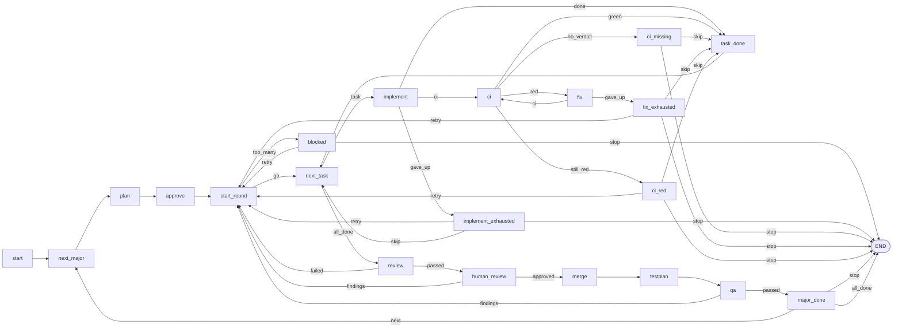

# Angular upgrade, one major at a time

The reference flow of Janus 4.0 v0.3 (spec sections 10 and 14), written as a node flow. It
upgrades one or more Angular applications, each a Git clone in a sub-folder of the goal folder,
through one major at a time: Codex plans and upgrades, TeamCity verifies the exact commit when it
is configured, a fresh Codex reviews the diff, a human reviews, a human merges, Codex proposes a
manual test plan and QA validates. Every "no" along the way is an edge back to `start_round`: the
work goes back to Codex with the findings, as a new round of the same major, and the flow moves to
the next major after a direction check.

Nothing here is engine code. `janus.py` knows nothing about Angular, Git branches or TeamCity;
all of that lives in the five step prompts and the preamble, in `flow.py` and in `teamcity.py`,
where it can be read and edited.

## The files

| File | What it is |
|---|---|
| `flow.py` | The flow: 21 `@node` functions over the primitives of spec section 4; `graph` draws them. |
| `prompts/_preamble.md` | Prepended to every prompt: the branch, the commit and the safety rules. |
| `prompts/plan.md` | Read-only survey of the repositories for one target major; returns ordered tasks. |
| `prompts/implement.md` | One task in one repository; sees `{{findings}}` of the round before. |
| `prompts/review.md` | Read-only review of the round; returns `passed`, `reasons`, `summary`. |
| `prompts/fix.md` | One red CI build; used only when TeamCity is configured. |
| `prompts/testplan.md` | Read-only proposal of the manual test plan QA runs; returns `steps`, `summary`. |
| `teamcity.py` | A short `urllib` helper: find a build by revision, poll it, report failed tests. |
| `JANUS.md` | The goal, and after the first run the open gate, the decisions and the progress. |
| `.gitignore` | Ignores the product clones (`*/`), keeps `prompts/`, `journals/` and `tests/`. |
| `tests/` | The example's own tests; they are not copied into a goal folder. |

`{{branch}}` and `{{target}}` come from `context(branch=..., target=...)` in the `next_major` node
of `flow.py`: the branch of Angular 16 is `ai/angular-15-to-16`, the branch of 17 is
`ai/angular-16-to-17`, and the preamble follows.

## Starting a goal folder from it

```bash
cp -r examples/angular-upgrade ~/work/angular-16-upgrade
cd ~/work/angular-16-upgrade
rm -rf tests README.md __pycache__   # __pycache__ appears once the example's tests have been run
cp /path/to/janus/janus.py .          # copied, not symlinked: the goal folder is self-contained
git init -b main . && git add -A && git commit -m "goal folder"

git clone <repo-url> ui-kit           # one clone per repository, as a sub-folder
git clone <repo-url> shell

$EDITOR JANUS.md                      # edit "# Goal": the repositories, the checks, the definition of done
$EDITOR flow.py                       # edit MAJORS at the top: [16] for one upgrade, [16, 17] for two
python3 janus.py graph                # print the map below; every edge you expect must be on it
python3 janus.py run
```

`run` stops at the first gate and exits with code 2. Answer it after `answer:` in `JANUS.md`
and run again; `python3 janus.py status` shows the current node visit, the open gate and the last
five steps. Every finished step is replayed from `journal.yaml`, so answering a gate never repeats
work. When `janus_ui.py` is present next to `janus.py` in the Janus repository, copy it too:
`python3 janus_ui.py` from the goal folder shows the run live in the browser, the map with the
visited nodes coloured, the current gate and every step.

## The nodes

Each stage of the flow is one function in `flow.py`, decorated with `@node(next=...)` that says
where it can go. The engine walks them from `start`, prefixes every step's key with the node and
its visit count (`implement#2/implement#1/1` is the ralph of the second visit of `implement`),
records the map under `graph:` and every visit under `path:` in `journal.yaml`, and checks each
visit against that path on replay. With one repository `app` and no TeamCity, a round that passes
every check journals eight steps: `plan#1/plan#1`, `approve#1/gate#1`, `implement#1/implement#1/1`,
`review#1/review#1`, `human_review#1/gate#1`, `merge#1/gate#1`, `testplan#1/testplan#1`,
`qa#1/gate#1`.



That block is the output of `python janus.py graph`, and the example's tests assert that it is.

| Node | `next` | What it does |
|---|---|---|
| `start` | `next_major` | `s.majors = list(MAJORS)`, `s.major_index = -1`. |
| `next_major` | `plan` | Steps to the next major: sets `s.target`, `context(branch=..., target=...)`, `round = 0`, `allowed = MAX_ROUNDS`, `findings = ""`. |
| `plan` | `approve` | `codex("prompts/plan.md")`: reads the repositories and proposes ordered tasks for Angular `<t>`. |
| `approve` | `start_round` | `human_gate` with the plan summary and one line per task; the human answers `yes`, or resets and edits. |
| `start_round` | `go`, `too_many` | `too_many` when the round allowance is used up; otherwise `round += 1`, `task_index = 0`, `finished = []`. |
| `blocked` | `retry`, `stop` | `decision` past `MAX_ROUNDS` rounds, with the last findings shown: `retry` allows `MAX_ROUNDS` more, `stop` ends the flow. |
| `next_task` | `task`, `all_done` | Picks `s.task = tasks[task_index]`, or goes to the review when none is left. |
| `implement` | `ci`, `done`, `gave_up` | Ralph of `implement.md` (up to `MAX_IMPLEMENT`) with the task, `done_so_far` and `findings`; `ci` when TeamCity is configured and `build_type` is not `none`. |
| `implement_exhausted` | `retry`, `skip`, `stop` | The blocker report: `retry` (next round, blockers as findings), `skip` (the task is left out of the round), `stop`. |
| `ci` | `green`, `red`, `no_verdict`, `still_red` | `step("wait", ...)` around `teamcity.wait_for_build` for the task's latest commit; `still_red` after `MAX_CI` red verdicts. |
| `ci_missing` | `skip`, `stop` | `decision` when the verdict is `NOT_FOUND` or `TIMEOUT`: nothing for Codex to fix. |
| `fix` | `ci`, `gave_up` | Ralph of `fix.md` (up to `MAX_FIX`) with the failed build; its commit goes back to `ci`. |
| `fix_exhausted` | `retry`, `skip`, `stop` | The blocker report of a fix: `skip` keeps the commits, red build and all. |
| `ci_red` | `retry`, `skip`, `stop` | `decision` when `MAX_CI` verdicts were all red: `retry` makes the failure the findings, `skip` keeps the commits. |
| `task_done` | `next_task` | Appends the task's record (id, repo, title, commit) to `finished`, logs it, `task_index += 1`. |
| `review` | `passed`, `failed` | `codex("prompts/review.md")` with the finished tasks and the round's findings; `failed` makes the reasons the next findings. |
| `human_review` | `approved`, `findings` | `human_gate` with the review summary and the task lines; anything but `approved` is the next findings. |
| `merge` | `testplan` | `human_gate`: the human merges and answers `merged`. |
| `testplan` | `qa` | `codex("prompts/testplan.md")`: the manual test plan, shown at the QA gate. |
| `qa` | `passed`, `findings` | `human_gate`; anything but `passed` is the next findings. |
| `major_done` | `next`, `stop`, `all_done` | Logs "Angular N reached in M round(s)"; `all_done` after the last major, else the direction `decision`. |

The keys are automatic: a node's steps are keyed by the primitive's default (`plan#1`,
`implement#1/<n>`, `gate#1`, `decision#1`, `wait`) under the node's visit, so `flow.py` passes no
`key=` anywhere. A visit count is per node, not per round: the human review of a round 2 that
follows a round the AI review sent back is `human_review#1/gate#1`, because it is the first time
that node runs; the round is on `s.round`, in the gate question and in the findings strings.
`stop` at any decision ends the flow through `END` with exit 0; the `## Progress` line says who
stopped it.

## How a round comes back

A round is the stretch from `start_round` to `qa`. Six edges carry findings back to `start_round`,
and `blocked`'s `retry` is the seventh; each of the six first stores why in `s.findings`, a string,
and logs `round N of Angular T came back: ...`:

1. `review -- failed`: the AI review returned `passed: false`; `findings` is
   `AI review of round N:\n<reasons>`.
2. `human_review -- findings`: the answer was not `approved`; `findings` is
   `Human review of round N:\n<answer>`.
3. `qa -- findings`: the answer was not `passed`; `findings` is `QA of round N:\n<answer>`.
4. `retry` at a blocker report, `implement_exhausted`, `fix_exhausted` or `ci_red`: `findings` is
   `Task <id> gave up at implement:\n<blockers>` (or `fix`) or `Task <id> is still red after 3 CI
   verdicts (<url>):\n<excerpt>`.

`start_round` then counts the round up and `implement.md` and `review.md` both render
`{{findings}}`: the implementer knows what to resolve, and the reviewer knows that work answering
a finding is requested, not a defect (Trial 2 found the reviewer rejecting the edit the human had
asked for). `findings` is the empty string in round 1, like `{{previous}}` in a ralph's first
iteration.

Replay does the rest. `run` executes `flow.py` from the top, walks the nodes from `start`, and
every finished step returns its journaled result without executing; `s` is rebuilt from those
results, so round 2 arrives with the same `findings` and the first step the journal does not know
is `implement#2/implement#1/1`. A gate inside round 2 opens and exits with code 2; the next run
replays both rounds up to that gate. The engine also checks the path: visit 11 must be the node
the journal recorded for visit 11, and a finished visit must take the edge it took before, or the
run stops with `flow changed`.

The bound: `start_round` goes to `blocked` when `MAX_ROUNDS` rounds have run, with the last
findings as `show`. `retry` raises the allowance by `MAX_ROUNDS` and `start_round` counts the
next round; the counter is never reset, so the round numbers in the log stay unique. `stop` ends
the flow.

The blocker report is the other way a round ends early. When a ralph gives up, `Exhausted.last`
is kept on `s.last` and shown at `implement_exhausted` or `fix_exhausted`: `retry` ends the round
and the blockers become the next round's findings; `skip` keeps what was committed and continues
the round (an implement task that is skipped is left out of the round's review); `stop` ends the
flow. The human does the tooling or access work while the decision is open. `reset` is not the
way back: it archives the journal, and every finished round with it.

## TeamCity (optional)

```bash
export JANUS_TEAMCITY_URL=https://teamcity.example.com
export JANUS_TEAMCITY_TOKEN=<a token with read access>
```

With both set, each task waits for the TeamCity build of its latest commit before the flow moves
on. With either unset, `teamcity.configured()` is false and the flow skips the wait and the fix
loop alike. `build_type` in a task is the TeamCity build type id, or the string `none`; a task
whose `build_type` is `none` skips the wait even when TeamCity is configured, so a repository
without a build does not hold the run up. `CI_TIMEOUT` at the top of `flow.py` (7200 s) is passed
explicitly to `teamcity.wait_for_build` and is the deadline for one wait: how long the poll loop
keeps asking TeamCity for one verdict before it gives up with `TIMEOUT`. Keep the
`JANUS_TEAMCITY_*` variables set, or unset, for the whole goal: `implement` chooses its `ci` edge
from them, and a replayed visit that chooses differently stops the run with `flow changed`.

The CI wait is a loop of its own, one visit of `ci` per verdict (`ci#1/wait`, `ci#2/wait`, `ci#3/wait`):

- `SUCCESS`: the task is recorded as finished with the commit CI just verified, and the flow moves on.
- `FAILURE`: the fix ralph runs (`fix#1/fix#1/<i>`, up to `MAX_FIX` iterations) with the failed
  test names in the prompt, and **the fix commit is waited for in turn** by the next visit of
  `ci`. A task may wait for `MAX_CI` verdicts in one round: the implement commit, then each fix.
  When the last allowed verdict is still red, `ci_red` opens its decision with the commit, the
  build URL and the excerpt: `retry` ends the round with that failure as the findings, `skip`
  keeps the commits and continues to the review, `stop` ends the flow.
- `NOT_FOUND` or `TIMEOUT`: there is nothing for Codex to fix, because CI never gave a verdict, so
  `ci_missing` opens its decision instead of a fix and asks the human to `skip` (keep the commit
  and move on) or `stop`.

**The token is not readable by Codex.** `teamcity.py` reads both variables once, at import, and
removes `JANUS_TEAMCITY_TOKEN` from `os.environ` as it reads it, before any Codex process starts.
`JANUS_TEAMCITY_URL` stays in the environment; it is not a secret. This matters because every
`codex exec` inherits this process's environment and runs with
`--dangerously-bypass-approvals-and-sandbox`, which is the Janus 4.0 trade-off: the machine Janus
runs on is the sandbox (spec section 7). Whatever else you export is readable by Codex, which is
why the preamble forbids echoing secrets: `journal.yaml` is committed and pushed after every step.

## Running the example's tests

From the repository root:

```bash
uv run pytest -q
```

`tests/test_teamcity.py` drives `teamcity.py` against a `http.server` stub on `127.0.0.1`, and
`tests/test_flow.py` runs the whole flow with the engine's fake `codex` in a temporary goal
folder, round by round and gate by gate, checks the `path` the journal records against the edges
above, and asserts that `python janus.py graph` prints the mermaid block of this README. Neither
needs the network, a TeamCity or the real Codex.

## Trial 1 (slice 2): Angular 15 to 16 with real Codex, 2026-09-23

Run on one throwaway application, without TeamCity, to satisfy spec criterion 12.7. **This report is
history**: it ran the slice 2 flow, whose keys (`plan`, `implement/<id>/<n>`, `review`, `merge`)
are Janus 4.0 keys from before the loops and the nodes above; the flow of this folder journals
`plan#1/plan#1`, `implement#1/implement#1/<n>` and so on. It is kept because its findings about
Codex still hold.

**Setup.** Goal folder `/home/race-day/janus-trial/angular-16-upgrade`, a Git repository with
the bare remote `/home/race-day/janus-trial/origin/angular-16-upgrade.git`. `janus.py` copied
from the repository at commit `12b129e`. The application is `app/`, a clone of the throwaway
`ng15-app` (Angular 15.2, three karma specs, default branch `master`) through the bare remote
`/home/race-day/janus-trial/origin/ng15-app.git`. Codex is codex-cli 0.155.1, model
`gpt-5.6-sol` at `xhigh` reasoning, from the user's own `~/.codex/config.toml`; Janus passes no
model flags. `JANUS_TEAMCITY_URL` and `JANUS_TEAMCITY_TOKEN` were unset, so `configured()` was
false and the flow skipped `ci/<id>` and `fix/<id>`. The goal named one repository, `app`, and
`flow.py`'s `BRANCH` was left at `ai/angular-15-to-16`.

**Runs.**

| Run | Command | Wall clock | Exit | Stopped at |
|---|---|---|---|---|
| 1 | `python3 janus.py run` | 77 s | 2 | gate `approve-plan` |
| 2 | `python3 janus.py run` | 493 s | 2 | gate `merge` |
| 3 | `python3 janus.py run` | < 1 s | 0 | flow ended |
| 4 | `python3 janus.py run` | < 1 s | 0 | flow ended, nothing re-executed |

Three Codex calls in all, 569 s of the 570 s total: `plan` 76 s, `implement/angular-16-upgrade/1`
123 s, `review` 370 s. Runs 3 and 4 started no `codex` process; run 4 replayed the whole journal
and left it byte-identical.

**Gates.**

| Key | Question | Shown | Answer |
|---|---|---|---|
| `approve-plan` | Approve this plan? … | `summary`, and `angular-16-upgrade [app] Upgrade …` | `yes` |
| `merge` | Every task is committed on `ai/angular-15-to-16` … | `id`, `repo`, `title`, `commit` | `merged` |

`approve-plan` was answered `yes` because the plan was one task, scoped to `app` and to Angular
16, and changed nothing else. There is no pull request in this trial, so `merged` stands for the
verified push: the bare `ng15-app.git` carries `ai/angular-15-to-16` at `4c0703e`. The
`implement/<id>/exhausted` decision and the `review-findings` gate never opened, so the known
`ai_gate` limitation (the reasons live only in `journal.yaml`) was not exercised.

**What Codex did.**

- `plan`: summary "One product repository was found: `app`, a clean Angular 15.2 application with
  no dependent repositories or TeamCity configuration. The upgrade will remain scoped to Angular
  16, preserve TypeScript and unrelated dependencies, verify installation/build/all three tests,
  then commit and push the required branch." One task, `id: angular-16-upgrade`, `repo: app`,
  `build_type: none`, objective: create the branch, `pnpm install`, `pnpm ng update
  @angular/core@16 @angular/cli@16` with every migration, keep TypeScript, then build, test,
  commit and push.
- `implement/angular-16-upgrade/1`: `done: true`, commit `4c0703e5a8879478cd69e1a03420b0ddff112dd0`,
  summary "Upgraded all Angular dependencies to 16, applied every offered migration, preserved
  TypeScript ~4.9.4, committed, and pushed `ai/angular-15-to-16`. `pnpm install` and `pnpm build`
  succeeded; the required ChromeHeadless test command passed all three specs.", `blockers: []`.
  One iteration was enough; `until=lambda r: r["done"]` ended the ralph at `/1`.
- `review`: `passed: true`, `reasons: []`, summary "The Angular 16 upgrade is sound: installation
  and build succeeded, and all three ChromeHeadless specs passed without test changes. The clean
  branch is pushed to origin at commit 4c0703e5a8879478cd69e1a03420b0ddff112dd0 with TypeScript
  and unrelated direct dependencies preserved."

**The result in `app/`.**

```text
* 4c0703e chore: upgrade Angular to version 16
* f8dc4e4 initial commit

 package.json   |   26 +-
 pnpm-lock.yaml | 2785 +++++++++++++++++++++++++++++++++-----------------------
 2 files changed, 1667 insertions(+), 1144 deletions(-)
```

`git status --porcelain` in `app/` was empty. Every `@angular/*` dependency is at `^16.2.12`,
with `@angular/cli` at `~16.2.16` and `@angular-devkit/build-angular` at `^16.2.16`; nothing is
left at 15. `typescript` is untouched at `~4.9.4`. The only other change is `zone.js` `~0.12.0`
to `~0.13.3`, which Angular 16 requires and `ng update` made. No source file, no spec and no
`angular.json` needed a migration, so the diff is the two dependency files only.

`app/` itself was not built or tested by hand, to keep it exactly as the flow left it. The checks
were run on a fresh clone of the pushed branch from the bare remote: `pnpm install` exited `0`,
`pnpm build` exited `0`, and `pnpm test --watch=false --browsers=ChromeHeadless` exited `0` with
`TOTAL: 3 SUCCESS`. The branch `ai/angular-15-to-16` was pushed to the bare remote by Codex
itself, in the implement step.

**Journal.**

```text
plan:                            codex   done      attempt 1
approve-plan:                    gate    answered  -
implement/angular-16-upgrade/1:  codex   done      attempt 1
review:                          ai_gate done      attempt 1
merge:                           gate    answered  -
```

No step failed, so no step was re-executed with `attempt: 2`. The goal folder has one commit per
status change (`janus: plan running`, `janus: plan done`, …), ten in all, each pushed to its bare
remote.

**Problems.**

- The plan step spent most of its 76 s reading the operator's own Codex skills. `~/.codex` loads
  a "superpowers" plugin, so the first thing the fresh process did was `sed` its way through
  `using-superpowers/SKILL.md` and `writing-plans/SKILL.md`, and its first streamed message was a
  schema-shaped `{"summary": "I'm using the required superpowers workflow …", "tasks": []}`. It
  recovered and returned a correct plan. Spec section 7 puts the model and its config in the
  user's hands, so Janus cannot prevent this; it is worth knowing that a prompt competes with
  whatever global instructions the operator's Codex already has.
- Codex, not the flow, chooses the journal keys. `plan.md` asks for "a short lowercase
  identifier", and Codex answered `angular-16-upgrade`, not `app`, so the ralph keys are
  `implement/angular-16-upgrade/<n>`. The keys are stable against edits to `flow.py`, as spec
  section 4 wants, but not against a re-plan: reset and plan again and the same work can land
  under a different key. If that matters, `plan.md` should tie `id` to `repo`.
- The review was the most expensive step of the trial, 370 s against the implement step's 123 s.
  Obeying "this step is read-only", it refused to run `pnpm install` in `app/` and instead built
  itself a `bwrap` sandbox, copied the working tree into a tmpfs and ran install, build and karma
  there. That is exactly the behaviour the prompt asks for, and it is worth three minutes; but a
  reviewer that re-runs the whole suite costs about as much as the implementation.
- The review read the implementer's own report. It ran `git show <sha>:journal.yaml` in the goal
  folder and read the `implement` result before judging it. The preamble forbids *editing*
  `journal.yaml`, not reading it, and the journal is committed next to the work, so the review is
  not blind. That is a prompt decision to make deliberately, either way.
- The implement step ran `find .. -name AGENTS.md -print`, reading above its repository folder.
  Nothing was written there and the preamble only forbids creating, changing or deleting outside
  the folder, but the boundary is a rule in a prompt, not a sandbox (spec section 13).
- Copying the example folder brings a `__pycache__/` with it if the tests have been run. `*/` in
  `.gitignore` keeps it out of Git, but `plan.md`'s ignore list names only `prompts`, `journals`,
  `tests` and dot-folders, so Codex could have proposed a task for it. It was deleted before the
  run. Either `plan.md` should ignore anything without a `.git`, or the quickstart should say to
  delete it along with `tests` and `README.md`.

**Engine gaps found.** One, at the very last statement of the flow. `log()` writes its line into
`## Progress` in `JANUS.md` but does not commit; only `save_journal()` commits, and it runs on a
status change. `flow.py`'s closing `log("flow finished")` comes after the last gate was answered
and therefore after the last commit, so that line stays uncommitted: a successful run ends with
`git status` showing ` M JANUS.md`, and the pushed `JANUS.md` never says the flow finished. It
cost nothing here and the trial was not stopped for it, but any `log()` after the last journaled
step of a flow is invisible to anyone reading the remote. It is fixed in the engine, by committing
once more before `cmd_run` returns, not in the example. No change was made to `janus.py` for this
trial.

**Verdict on spec 12.7.** Met. The example ran on the throwaway app with real Codex through the
plan, the approval gate, the implementation loop and the review gate, and left `app` on Angular
16 with `pnpm build` and all three specs green on the pushed branch.

## Trial 2 (slice 3): a round sent back by the human review, with real Codex, 2026-09-23

Run on one throwaway application, without TeamCity, to satisfy spec criterion 12.9: the human
review of round 1 answers with a finding, the next round runs with real Codex under its own keys,
the finished flow is run once more and the journal does not change. **This report is history**: it
ran the slice 3 script flow, whose keys (`v16/r1/implement/app/1`, `v16/r2/review`) are Janus 4.0
keys; the node flow of this folder journals `implement#2/implement#1/1`, `review#2/review#1` and
records a `path`. Its finding about the AI review is what `review.md`'s `{{findings}}` paragraph
answers, and Trial 3 checks that. It took **three** rounds, not
two: the AI review of round 2 rejected half of what the human finding had asked for and sent the
round back on its own, so round 3 ran before the human review was reached again. That is the most
interesting result of the trial and it is described under *How the rounds came back*.

**Setup.** Goal folder `/home/race-day/janus-trial/slice3-angular-16`, a Git repository with the
bare remote `/home/race-day/janus-trial/origin/slice3-angular-16.git`. `janus.py` copied from the
worktree at commit `a5fdc59`; its blob is identical to `main`'s at `137ab59` (slice 3 changed no
engine code). The application is `app/`, a clone of
`/home/race-day/janus-trial/origin/ng15-app-slice3.git`, a bare made from the slice 2 remote's
`master` alone (`f8dc4e4`, Angular 15.2, three karma specs), because the slice 2 remote already
carried `ai/angular-15-to-16` from Trial 1. Codex is codex-cli 0.155.1, model `gpt-5.6-sol` at
`xhigh` reasoning from `~/.codex/config.toml`; Janus passes no model flags. Node v24.5.0, pnpm
10.33.0, PyYAML 6.0.1. `JANUS_TEAMCITY_URL` and `JANUS_TEAMCITY_TOKEN` were unset, so no `ci/` key
was journaled. `MAJORS = [16]`, so the branch was `ai/angular-15-to-16` and no `direction`
decision opened.

**Runs.**

| Run | Command | Wall clock | Exit | Stopped at |
|---|---|---|---|---|
| 1 | `python3 janus.py run` | 108 s | 2 | gate `v16/approve-plan` |
| 2 | `python3 janus.py run` | 263 s | 2 | gate `v16/r1/human-review` |
| 3 | `python3 janus.py run` | 622 s | 2 | gate `v16/r3/human-review` (round 2 came back by itself) |
| 4 | `python3 janus.py run` | < 1 s | 2 | gate `v16/r3/merge` |
| 5 | `python3 janus.py run` | 91 s | 2 | gate `v16/r3/qa` |
| 6 | `python3 janus.py run` | < 1 s | 0 | flow ended, `Angular 16 reached in 3 round(s)` |
| 7 | `python3 janus.py run` | 1 s | 0 | flow ended, nothing re-executed, journal byte-identical |

Eight Codex calls in all, 1084 s of the 1085 s the seven runs took (each span is the journal's
`started` to `finished`, so it also covers that step's own commit): `v16/plan` 108 s,
`v16/r1/implement/app/1` 121 s, `v16/r1/review` 142 s, `v16/r2/implement/app/1` 124 s,
`v16/r2/review` 187 s, `v16/r3/implement/app/1` 111 s, `v16/r3/review` 200 s, `v16/r3/testplan`
91 s. Every ralph finished in one iteration and every step succeeded on `attempt 1`; no step was
retried, no `exhausted`, `blocked`, `red` or `missing` decision opened. Runs 4, 6 and 7 started no
`codex` process.

**Gates.**

| Key | Question | Shown | Answer |
|---|---|---|---|
| `v16/approve-plan` | Approve this plan for Angular 16? … | `summary`, one `app [app] …` line | `yes` |
| `v16/r1/human-review` | Review the pull requests of round 1. … | `summary`, `tasks` | the finding (below) |
| `v16/r3/human-review` | Review the pull requests of round 3. … | `summary`, `tasks` | `approved` |
| `v16/r3/merge` | Merge the pull requests of round 3 … | task line with `b0a1ed4` | `merged` |
| `v16/r3/qa` | QA: run this test plan … | `summary`, 9 `steps` | `passed` |

Round 2 opened no gate: its AI review failed, which ends the round before `human-review`.

The finding written at `v16/r1/human-review`: "README.md still says the project was generated
with Angular CLI version 15.2.11. Change that line to Angular CLI 16 and add one line under the
title saying the app was upgraded from Angular 15 to 16 on this branch. Also confirm in your
summary which zone.js version package.json asks for now." There is no pull request in this trial,
so `merged` stands for the verified push: the bare `ng15-app-slice3.git` carries
`ai/angular-15-to-16` at `b0a1ed42ec363ecb4156f26cfdacc8432ff3a252`, the SHA the merge gate
showed.

**How the rounds came back.** Run 3 replayed `v16/plan`, `v16/approve-plan`,
`v16/r1/implement/app/1` and `v16/r1/review` from the journal — their entries are byte-identical
before and after the run, 4 of 4 round-1 entries unchanged — read the answer of
`v16/r1/human-review`, built `findings = "Human review of round 1:\n<the finding>"`, and the first
key it did not know was `v16/r2/implement/app/1`, which ran with that string in `{{findings}}`.
The run log shows the rendered block verbatim under "Why the previous round of this upgrade came
back is below". Round 2's Codex did exactly what the finding asked. Its AI review then set
`passed: false` over one of those two edits, so `run_round` returned without opening a human gate
and the same run went straight into round 3 with `findings = "AI review of round 2:\n<the
reason>"`, again visible in the log. Round 3's Codex reverted the generated-with line and kept the
upgrade note, and its review passed. The journal therefore holds `v16/r2/implement/app/1` and
`v16/r2/review` but no `v16/r2/human-review`: a round that the AI review ends leaves only the keys
it reached, and the numbering of the later keys follows the loop counter, not the gate.

**What Codex did.**

- `v16/plan`: summary "The workspace contains one product repository, `app`, with no
  inter-repository dependencies or TeamCity build type. The plan upgrades it only from Angular 15
  to Angular 16, preserves TypeScript and unrelated dependencies, applies all official migrations,
  and verifies installation, build, and all three existing tests before commit and push."; one
  task with `id: app`, `repo: app`, `title: Upgrade app from Angular 15 to Angular 16`,
  `build_type: none`, and an objective naming the branch, the two `ng update` packages and the
  three checks. `id` is `app`, the repository folder, as `plan.md` now requires.
- `v16/r1/implement/app/1`: `done: true`, commit `a079274` ("chore: upgrade Angular to 16"),
  summary "Upgraded all Angular runtime and build dependencies from 15 to 16, applied every
  offered migration, and preserved TypeScript at ~4.9.4. `pnpm install`, `pnpm build`, and the
  required ChromeHeadless test command succeeded with all 3 specs passing; the clean branch was
  pushed to origin.", `blockers: []`.
- `v16/r1/review`: `passed: true`, `reasons: []`, summary "The app is clean and fully upgraded to
  Angular 16 on the pushed ai/angular-15-to-16 branch; only package.json and pnpm-lock.yaml
  changed, with TypeScript untouched and no Angular 15 dependencies remaining. …"
- `v16/r2/implement/app/1`: `done: true`, commit `9db9440` ("docs: note Angular 16 upgrade"),
  summary "Updated README.md to document the Angular 15-to-16 upgrade and Angular CLI 16;
  package.json requests zone.js ~0.13.3. …", `blockers: []`. It names the `zone.js` version the
  finding asked about, so all three parts of the finding were answered.
- `v16/r2/review`: `passed: false`, one reason: "app/README.md: The upgrade commit incorrectly
  changes the boilerplate to claim the project was generated with Angular CLI 16; retain the
  original generation version or describe only the upgrade."; summary "The Angular 16 dependency
  upgrade is otherwise complete, clean, and pushed on the required branch. …"
- `v16/r3/implement/app/1`: `done: true`, commit `b0a1ed4` ("docs: preserve original Angular CLI
  version"), summary "Corrected the README to preserve the original Angular CLI 15.2.11 generation
  version and pushed the fix. …", `blockers: []`.
- `v16/r3/review`: `passed: true`, `reasons: []`, summary "The app is clean, committed, and pushed
  on ai/angular-15-to-16 at b0a1ed42ec363ecb4156f26cfdacc8432ff3a252, with all Angular
  dependencies upgraded to version 16 and TypeScript unchanged. …"
- `v16/r3/testplan`: summary "The main risk is framework-level runtime compatibility: the upgrade
  changed Angular packages and Zone.js but did not migrate application source files. …"; nine
  steps, each an action and its expected result: load `/` and see the toolbar and the
  "ng15-app app is running!" highlight; hard-refresh with console and network open and see no
  Angular, Zone.js or uncaught error; scroll the whole page; check the terminal starts at
  `ng generate component xyz`; click the six Next Steps buttons in sequence and check each
  terminal line; focus a button with Tab and activate it with Enter or Space; open a Resources
  card and a footer link in a new tab; load an unconfigured path such as `/route-smoke` and see
  the shell bootstrap with an empty outlet; resize from desktop to a narrow viewport. QA could run
  every one of them on this app: it is one component with six buttons, an empty router outlet and
  three specs, and the plan tests exactly that, without inventing forms, routes or services.

**The result in `app/`.**

```text
* b0a1ed4 docs: preserve original Angular CLI version
* 9db9440 docs: note Angular 16 upgrade
* a079274 chore: upgrade Angular to 16
* f8dc4e4 initial commit

 README.md      |    2 +
 package.json   |   26 +-
 pnpm-lock.yaml | 2785 +++++++++++++++++++++++++++++++++-----------------------
 3 files changed, 1669 insertions(+), 1144 deletions(-)
```

`README.md` after round 3, first lines: `# Ng15App`, blank, `This app was upgraded from Angular 15
to Angular 16 on this branch.`, blank, `This project was generated with [Angular
CLI](https://github.com/angular/angular-cli) version 15.2.11.` — round 2 had written `version 16.`
on that last line and round 3 put `15.2.11` back, which is the visible trace of the two rounds.
`zone.js` is at `~0.13.3`, `@angular/core` at `^16.2.12`, `@angular/cli` at `~16.2.16`,
`typescript` untouched at `~4.9.4`. `git status --porcelain` in `app/` was empty, and the bare
`ng15-app-slice3.git` lists `ai/angular-15-to-16 b0a1ed4` beside the untouched `master f8dc4e4`.
Nothing under `app/` was edited by hand and no commit of Codex's was amended.

**Journal.**

```text
v16/plan                         codex     done      attempt 1
v16/approve-plan                 gate      answered  -
v16/r1/implement/app/1           codex     done      attempt 1
v16/r1/review                    codex     done      attempt 1
v16/r1/human-review              gate      answered  -
v16/r2/implement/app/1           codex     done      attempt 1
v16/r2/review                    codex     done      attempt 1
v16/r3/implement/app/1           codex     done      attempt 1
v16/r3/review                    codex     done      attempt 1
v16/r3/human-review              gate      answered  -
v16/r3/merge                     gate      answered  -
v16/r3/testplan                  codex     done      attempt 1
v16/r3/qa                        gate      answered  -
```

No `v16/direction` (one major) and no `ci/` key (no TeamCity). `## Progress` holds
`round 1 of Angular 16 came back: Human review of round 1:`,
`round 2 of Angular 16 came back: AI review of round 2:` and `Angular 16 reached in 3 round(s)`;
`## Decisions` holds all five answered gates, each with its question and its answer in full:
`v16/approve-plan` `yes`, `v16/r1/human-review` the finding, `v16/r3/human-review` `approved`,
`v16/r3/merge` `merged` and `v16/r3/qa` `passed`. The goal folder has one commit per status
change, all pushed, and `git status --porcelain` is empty —
the `log()`-after-the-last-commit problem of Trial 1 is gone, because run 6 ends with
`janus: run ended`.

**Problems.**

- The AI review and the human review contradicted each other. The human asked for the
  generated-with line to say Angular CLI 16; the next round's AI reviewer called that wrong and
  sent the round back, and round 3 undid it. The flow behaved exactly as written — the AI review
  runs before the human gate and any `passed: false` ends the round — but a human finding can be
  overruled by a machine on the next pass without anyone being asked. The findings string carries
  only the last round's reason, so round 3's Codex never saw the human's wish; it saw only the
  reviewer's objection. `## Progress` and `## Decisions` keep the history, but the prompt does
  not. A flow that wants the human to win would have to carry the human findings forward (or ask
  at a gate when the AI review contradicts an answered human review); that is a flow change, not
  an engine change. The next spec revision's mitigation is to pass `findings` to
  `prompts/review.md` as well, so the reviewer knows what a human or an earlier review asked for
  and does not call a requested change a defect.
- The round numbers in the keys are loop counters, not gate counters, so the merge, test plan and
  QA of this trial sit under `v16/r3/...` although only two human reviews happened. Anyone reading
  the journal has to know that round 2 ended at its AI review.
- The trial used its whole `MAX_ROUNDS = 3` allowance: a fourth send-back would have opened the
  `v16/r4/blocked` decision.
- Two of the three `implement` iterations streamed several intermediate JSON objects that satisfy
  the schema (`{"done":false,…}`) before the final one; only the last is journaled, which is
  correct, but a log reader can mistake an early one for the result.

**Engine gaps found.** None. Every gate, decision and loop the trial needed was expressible with
`codex`, `ralph`, `human_gate`, `decision`, `step`, `log` and `context` as they are; the return
loop worked from the flow's own `while True` and the keys it builds. No change was made to
`janus.py` for this trial.

**Verdict on spec 12.9.** Met. A round was sent back by the human review answer: the finding at
`v16/r1/human-review` became `{{findings}}` in `v16/r2/implement/app/1`, which ran with real Codex
under `v16/r2/` keys and made the commit the finding asked for. Every round-1 entry stayed
byte-identical (4 of 4). The finished flow, run once more, executed nothing, printed only the
replayed `log()` lines and `flow ended`, exited 0 in 1 s and left `journal.yaml` byte-identical.
The one departure from the plan is that the flow needed three rounds instead of two, because the
AI review of round 2 sent that round back as well — which §12.9 allows (a round, not round 1) and
which exercised the return loop twice instead of once.
